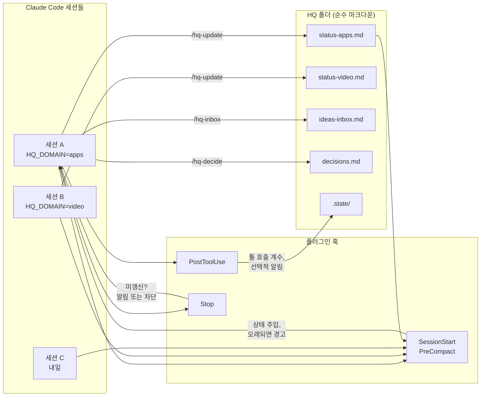

# session-hq

**Claude Code 세션을 다섯 개 돌린다. 그런데 어느 세션도 다른 세션이 어제 무엇을 했는지 모른다.**

session-hq는 그 세션들에게 파일 기반의 공유 본부(HQ)를 제공한다. 도메인마다 마크다운 파일 하나를 두고,
모든 세션이 시작할 때 그것을 읽고 끝날 때 갱신한다. 아이디어 인박스와 결정 로그도 함께 제공되며,
전 과정은 훅으로 강제되고 그 주기는 사용자가 정한다.

[English](README.md) · [한국어](README.ko.md)

---

## 60초 데모

```console
$ claude
──────────────────────────────────────────────────────────────────────────────
## session-hq — HQ status for this session

Domain: **apps**   ·   HQ root: `~/hq`
Last updated 19h ago (from stamp).

### 결제 재시도 큐
- 상태: 재시도는 정상 동작하나, dead-letter 경로에서 원본 에러가 유실됨.
- 다음: queue/retry.ts:88 의 DeadLetter.record() 에 에러 필드 추가
- 대기: 없음
- 배제됨: 직렬화 문제 아님 — enqueue 시점에는 필드가 있고 워커의
  structuredClone 이후 사라짐. 양쪽에서 diff 로그로 확인함.
- 갱신: 2026-01-30 (apps)
──────────────────────────────────────────────────────────────────────────────

> 재시도 큐 건, 이어서 해줘

이전 세션의 조사 결과를 가지고 있습니다. 필드가 enqueue 는 통과하고 워커에서
사라지므로 직렬화 문제는 배제된 상태입니다. 바로 DeadLetter.record() 부터
보겠습니다.

  … 40분간 작업 …

> 오늘은 여기까지

  session-hq: this session used 34 tools but `status-apps.md` is unchanged.
  Append what happened — outcome, next step, blockers, and anything you ruled
  out — then stop. Negative results matter: they stop the next session
  repeating your work.

> /hq-update

`status-apps.md` 갱신:
  - 상태: 수정 완료. record() 가 원본 에러를 전달하며 픽스처 통과.
  - 배제됨: 재시도 백오프는 무관 — 수정 전후 타이밍이 동일함.
```

<!-- TODO: 실제 녹화본으로 교체 -->

이 플러그인의 값어치를 혼자 감당하는 항목은 **배제됨(Ruled out)** 이다. 모든 세션이 가장 생략하고 싶어 하는
줄이자, 세 개의 세션이 각자 똑같은 막다른 길을 다시 발견하는 것을 막아 주는 유일한 줄이다.

## 설치

Claude Code와 Node 18 이상이 필요하다. 그 외 의존성은 없다.

```bash
# 이 저장소를 마켓플레이스로 등록한 뒤 플러그인을 설치한다
claude plugin marketplace add your-github-username/session-hq
claude plugin install session-hq@session-hq

# 로컬 클론에서 설치하는 경우
git clone https://github.com/your-github-username/session-hq
claude plugin marketplace add ./session-hq
claude plugin install session-hq@session-hq
```

그다음 Claude Code 안에서:

```
/hq-init
```

어떤 도메인을 쓸지 물어본 뒤 `~/hq`에 설정 파일, 도메인별 상태 파일, 아이디어 인박스, 결정 로그를 만들고
다음에 할 일을 알려 준다. **끝나면 Claude Code를 재시작해야 한다.** 훅은 세션 시작 시점에 로드되므로,
`/hq-init`을 실행한 그 세션은 아직 훅 없이 돌아가고 있다.

각 세션에 도메인을 지정하려면 세션을 띄우기 전에 `HQ_DOMAIN` 환경 변수를 설정하거나, 한 종류의 작업만 하는
머신이라면 `hq.config.json`의 `defaultDomain`을 설정한다.

확인은 `claude plugin list`, `/hooks`, `/hq-doctor`로 한다.

## 동작 방식



구성 요소는 네 가지다.

1. **SessionStart**가 해당 세션의 `status-<domain>.md`를 `inject.maxLines` 만큼 잘라서 주입한다.
   파일이 `inject.staleAfterHours`보다 오래되었으면 경고 배너가 붙는다.
2. **PostToolUse**가 툴 호출 횟수를 `<hqRoot>/.state/<session-id>.json`에 기록하고, `periodic` 모드에서는
   조절된 간격으로 알림을 보낸다.
3. **Stop**이 세션 시작 이후 상태 파일이 바뀌었는지 검사한다. 실제로 작업을 했는데 아무것도 기록하지
   않았다면 그 사실을 알린다.
4. **내용은 사람이 쓴다.** `/hq-update`를 통해서만 기록된다. 플러그인이 상태를 지어내는 일은 없다.

HQ는 사용자가 정한 폴더 안의 순수 마크다운이다. git 저장소든, 동기화 드라이브든, 노트 볼트든,
다른 세션들에게 파일이 전달되기만 하면 된다.

## 주기 설정

작업 방식에 맞지 않는 잔소리는 결국 꺼지고, 그러면 체계 전체가 썩는다. 그래서 주기는 일급 설정으로 둔다.
HQ 루트의 `hq.config.json`이다.

```json
{
  "hqRoot": "~/hq",
  "domains": ["video", "apps", "business"],
  "defaultDomain": null,
  "inject":    { "on": "session-start", "maxLines": 60, "staleAfterHours": 48 },
  "update":    { "mode": "on-stop", "everyNTools": 0, "minMinutesBetween": 20, "enforce": false },
  "inbox":     { "file": "ideas-inbox.md" },
  "decisions": { "file": "decisions.md" },
  "language":  "en"
}
```

| 키 | 값 | 역할 |
|---|---|---|
| `inject.on` | `session-start` · `session-start+compact` · `off` | 상태 파일을 언제 주입할지. `+compact`는 컨텍스트 압축 후에도 유지된다 — 긴 세션이 맥락을 잃는 지점이 대개 여기다. |
| `inject.maxLines` | 정수 | 주입 분량 상한. 긴 파일은 잘리고 원본 파일 위치가 안내된다. |
| `inject.staleAfterHours` | 숫자 | 이보다 오래되면 "의존하기 전에 검증하라"는 배너가 붙는다. |
| `update.mode` | `on-stop` · `periodic` · `manual` | `on-stop`: 종료 시 검사. `periodic`: 작업 중 알림. `manual`: 알림 없음, 명령어만. |
| `update.everyNTools` | 정수 | `periodic` 전용. N번의 툴 호출마다 알림. `0`이면 비활성. |
| `update.minMinutesBetween` | 숫자 | `periodic` 전용. 알림 사이의 최소 간격. 툴 호출이 몰려도 알림이 몰리지 않게 한다. |
| `update.enforce` | 불리언 | `on-stop` 전용. `false`(기본값)는 알림, `true`는 파일을 갱신할 때까지 종료를 **차단**한다. |
| `language` | `en` · 임의의 태그 | 생성되는 템플릿의 언어 힌트. |

실제로 쓰이는 세 가지 설정:

- **가벼움** — `mode: "on-stop"`, `enforce: false`. 종료 시 알림 한 번, 무시해도 된다. 기본값이다.
- **코칭** — `mode: "periodic"`, `everyNTools: 40`, `minMinutesBetween: 20`. 팀이 습관을 들이는 동안 유용하다.
- **엄격** — `mode: "on-stop"`, `enforce: true`. 기록하지 않으면 세션이 끝나지 않는다. 인수인계 누락이
  다른 사람의 오전을 통째로 날리는 공유 저장소에 적합하다. Stop 훅의 차단 결정을 사용하며, 실제로 그만큼
  성가시게 느껴진다.

전체 레퍼런스: [docs/config.md](docs/config.md).

## 스킬로 제공되는 두 가지 관행

상태 파일이 메커니즘이라면, 아래 둘은 그것을 쓸 만하게 만드는 관행이다.

**[layered-memory](skills/layered-memory/SKILL.md)** — `MEMORY.md` → `index-<domain>.md` → 파일 하나당
사실 하나. 세션은 자기 작업에 해당하는 인덱스만 읽고 나머지는 읽지 않으므로, 기억의 비용이 전체 분량이
아니라 관련성에 비례하게 된다. 프론트매터 스키마, 분류 우선 규칙, 6주 뒤에도 그 지시가 무시되지 않게
하는 Why / How-to-apply 형식을 포함한다. 기존 디렉터리 점검은 `/memory-lint`로 한다.

**[orchestrator-routing](skills/orchestrator-routing/SKILL.md)** — 코디네이터가 지시서를 쓰고 결과를
검토하며, 구현과 리서치는 다른 계층에 위임하는 구조. 지시서 템플릿과 "보여주기 전 검토" 체크리스트를
포함한다. 요약하자면, 검토 없는 위임은 위임이 아니라 그냥 일을 옮긴 것이다.

**[hq-protocol](skills/hq-protocol/SKILL.md)** 이 세 번째다. 언제 읽고 언제 쓰는지, 제대로 된 상태 항목에
무엇이 들어가는지, 오래된 파일과 충돌하는 항목을 어떻게 다루는지를 다룬다.

## Claude Code 기본 기능과의 관계

과장 없이 정리하면 이렇다.

| | 범위 | 수명 |
|---|---|---|
| **세션 간 메시징** (기본 기능) | 지금 동시에 돌고 있는 세션들 사이 | 실시간, 휘발성 — 세션이 끝나면 사라짐 |
| **session-hq** | 며칠에 걸친 세션들 사이 | 영속적, 비동기 — 작성한 세션보다 오래 남음 |
| **자동 메모리** (기본 기능) | 한 프로젝트에 대한 사실 | 프로젝트 단위 |
| **session-hq** | 여러 프로젝트에 걸친 현재 상태 | HQ 하나, 도메인 여럿 |

경쟁 관계가 아니라 보완 관계다. 기본 메시징은 옆 세션에게 지금 당장 물어보는 수단이고, session-hq는
그 세션이 지난주에 무엇을 결론지었는지 알아내는 수단이다. 자동 메모리는 *이 저장소*가 어떻게 돌아가는지를
기억하고, HQ는 모든 저장소를 통틀어 지금 무슨 일이 벌어지고 있는지를 기억한다. 프로젝트 하나에서 세션
하나만 돌린다면 이 플러그인은 아마 필요하지 않다.

## 하지 않는 것

- **다중 계정 관련 기능은 없다.** 이것은 계정 하나에 세션 여럿인 상황을 위한 것이다. 사용량 제한을
  우회하는 기능은 없고, 추가 요청도 받지 않는다.
- **API 프록시, 트래픽 수준의 모델 라우팅, 요청 가로채기 없음.** (`orchestrator-routing` 스킬은
  위임할 때 어느 계층에 맡길지 고르는 프롬프트 수준의 관행이지, 네트워크 계층이 아니다.)
- **의존성 없음.** Claude Code가 이미 요구하는 Node 외에는 아무것도 필요 없다. 네이티브 모듈도,
  설치 단계도, 데몬도 없다.
- **자동 작성 없음.** 플러그인은 알릴 뿐, 상태 항목을 지어내지 않는다. 상태 파일은 실제로 그 작업을 한
  사람이나 세션이 썼을 때에만 읽을 가치가 있다.
- **아카이브가 아니다.** HQ는 현재 상태만 담는다. 전체 대화 기록은
  [recipes/conversation-archiver.md](recipes/conversation-archiver.md)를 참고할 것.

## 레시피

HQ와 잘 어울리는 패턴들이다. 남의 인프라를 그대로 물려받지 않고 각자 상황에 맞게 바꿔 쓸 수 있도록,
코드로 제공하지 않고 레시피 문서로 제공한다.

- [notifier-telegram.md](recipes/notifier-telegram.md) — 상태 변화를 채팅으로 푸시
- [deadline-reminder.md](recipes/deadline-reminder.md) — Windows·macOS·Linux 예약 리마인더
- [conversation-archiver.md](recipes/conversation-archiver.md) — Stop 훅으로 마크다운 볼트에 보관
- [screen-look.md](recipes/screen-look.md) — 세션이 화면을 볼 수 있게 하기

## 문서

- [docs/design.md](docs/design.md) — 문제 정의, 아키텍처, 설계상의 트레이드오프
- [docs/config.md](docs/config.md) — 모든 설정 키
- [docs/case-studies.md](docs/case-studies.md) — 이것이 없을 때 무엇이 잘못되는지에 대한 사례 세 편

## 기여

[CONTRIBUTING.md](CONTRIBUTING.md)를 참고할 것. PR을 열기 전에 `node --test`와
`node scripts/leak-check.mjs --denylist <자신의 denylist>`를 실행한다.

## 라이선스

MIT — [LICENSE](LICENSE) 참조.
