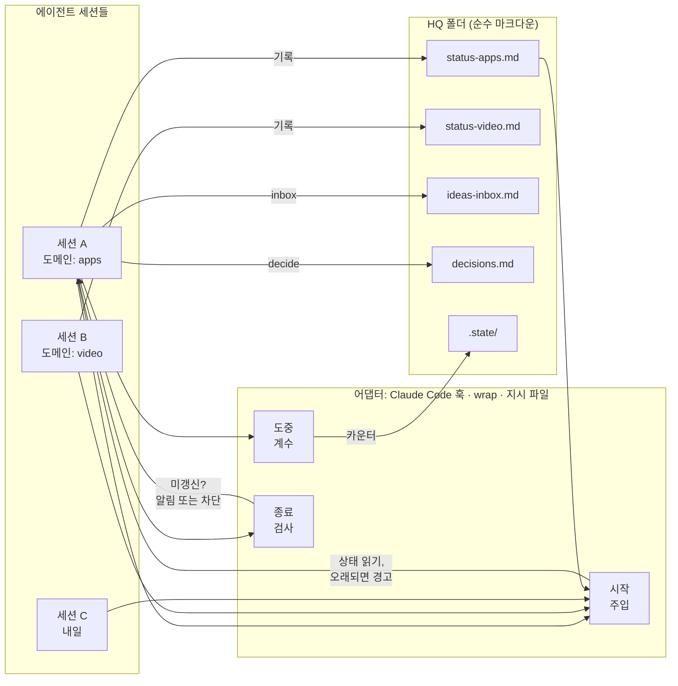

# session-hq

**에이전트 세션을 다섯 개 돌린다. 그런데 어느 세션도 다른 세션이 어제 무엇을 했는지 모른다.**

session-hq는 AI 코딩 에이전트 세션들을 위한 파일 기반 공유 본부(HQ)다. Claude Code, Codex,
Gemini CLI, Cursor, aider, 혹은 셸에서 돌리는 로컬 모델까지 — 도메인마다 마크다운 상태 파일 하나를
두고, 세션 시작 시 읽고 세션 종료 시 기록한다.

[English](README.md) · [한국어](README.ko.md)
[](https://github.com/your-github-username/session-hq/actions/workflows/test.yml)

---

## 왜 필요한가

세션 하나에서 전부 돌릴 수도 있다. 그러면 두 가지가 잘못된다. 관계없는 작업들이 뒤섞이고 컨텍스트가
계속 불어나면서 품질이 떨어진다 — 썸네일을 묻는데 모델은 어제의 결제 버그를 여전히 안고 있다. 그리고
언젠가 압축이 필요한 것을 지워 버린다. 두 번째 문제는 세컨드 브레인이 덜어 준다. 노트 볼트든, 메모리
파일을 담은 git 저장소든, 컨텍스트 창 밖에 남는 것이면 된다. session-hq는 그것을 대체하지 않으며,
그것은 그것대로 있어야 한다.

그래서 나눈다. 프로젝트당 하나든 도메인당 하나든, 각자 편한 기준으로. 뒤섞임은 사라지고 세션마다
날이 서 있게 된다.

그런데 다섯 번째나 여섯 번째 세션쯤에서 다른 문제가 나타난다. 고장 난 것은 없다. 모든 세션이 제 일을
잘하고 있다. 다만 그것이 더 이상 보이지 않는다 — 무엇이 멈춰 있는지, 무엇이 내 답을 기다리는지, 일주일째
아무도 손대지 않은 것이 무엇인지. 전부 어딘가에 있기는 한데, 머릿속에 담기에는 창이 너무 많다.

이 세 번째 문제가 이 도구가 푸는 문제다. 각 세션이 한곳에 보고하고, 한 화면이 그 전부를 보여 준다.

구조는 조직도다. 각 세션은 자기 부서를 운영하는 부서장이고, 그 영역은 당신보다 훨씬 잘 안다. HQ는 그들이
올리는 보고서다 — 무엇이 멈췄고, 무엇이 막혔고, 아무도 집어 들지 않은 것이 무엇인지를 대표가 확인하는
문서. 모든 부서 회의에 들어가고 싶은 사람은 없다. 보고서를 원할 뿐이다. `hq.mjs dashboard`가 그
보고서다.

## 60초 데모

훅이 있어 자동으로 동작하는 Claude Code 기준 화면이다. 다른 에이전트는 [`wrap`](docs/adapters.md)
이나 각자의 지시 파일로 같은 프로토콜을 돌린다.

```console
$ claude
──────────────────────────────────────────────────────────────────────────────
## session-hq — HQ status for this session

Domain: **apps**   ·   HQ root: `~/hq`
Last updated 19h ago (from stamp).

### 결제 재시도 큐
- 상태: 재시도는 정상 동작하나, dead-letter 경로에서 원본 에러가 유실됨.
- 다음: queue/retry.ts:88 의 DeadLetter.record() 에 에러 필드 추가
- 대기: 없음
- 배제됨: 직렬화 문제 아님 — enqueue 시점에는 필드가 있고 워커의
  structuredClone 이후 사라짐. 양쪽에서 diff 로그로 확인함.
- 갱신: 2026-01-30 (apps)
──────────────────────────────────────────────────────────────────────────────

> 재시도 큐 건, 이어서 해줘

이전 세션의 조사 결과를 가지고 있습니다. 필드가 enqueue 는 통과하고 워커에서
사라지므로 직렬화 문제는 배제된 상태입니다. 바로 DeadLetter.record() 부터
보겠습니다.

  … 40분간 작업 …

> 오늘은 여기까지

  session-hq: this session used 34 tools but `status-apps.md` is unchanged.
  Append what happened — outcome, next step, blockers, and anything you ruled
  out — then stop. Negative results matter: they stop the next session
  repeating your work.

> /hq-update

`status-apps.md` 갱신:
  - 상태: 수정 완료. record() 가 원본 에러를 전달하며 픽스처 통과.
  - 배제됨: 재시도 백오프는 무관 — 수정 전후 타이밍이 동일함.
```

<!-- TODO: 실제 녹화본으로 교체 -->

이 전체의 값어치를 혼자 감당하는 항목은 **배제됨(Ruled out)** 이다. 모든 세션이 가장 생략하고 싶어
하는 줄이자, 세 개의 세션이 각자 똑같은 막다른 길을 다시 발견하는 것을 막아 주는 유일한 줄이다.

## 무엇인가

마크다운 파일이 담긴 폴더 하나와, 의존성 없는 Node CLI 하나. 이 둘이 제품 전부이고, Claude Code
플러그인은 그 위에 얹힌 어댑터 하나일 뿐이다.

```
~/hq/
  hq.config.json      주기와 레이아웃 설정
  status-video.md     도메인별 파일 하나 — 한 세션이 통째로 다루게 되는 작업 갈래
  status-apps.md
  status-business.md
  ideas-inbox.md      아이디어 한 줄씩. 약속이 아니다
  decisions.md        결정 한 줄씩. 추가만 하고 수정하지 않는다
  .state/             어댑터가 쓰는 세션별 기록. 사람이 읽을 것은 아니다
```

상태 파일은 작업 갈래마다 `###` 블록 하나씩이고, 각 블록에 다섯 개 항목이 들어간다.

```
### 결제 재시도 큐
- 상태: 실제로 어디까지 왔는지 한 줄. "X 작업함"은 상태가 아니라 근무일지다
- 다음: 파일·명령어·사람 중 하나. "이어서 진행"은 안 된다
- 대기: 무엇이 누구를 기다리는지. "없음"도 유효한 답이다
- 배제됨: 시도했는데 안 된 것과 그 근거
- 갱신: YYYY-MM-DD (어느 세션인지)
```

**핵심은 배제됨이다.** 세 세션이 각각 40분씩 같은 플랫폼 제약을 다시 발견하는 것은, 30초면 쓸 수 있는
한 줄 때문에 두 시간을 날리는 일이다. 제거한 가설은 반드시 근거와 함께 적는다 — 에러 메시지, 측정값,
비교 결과. 제대로 확인한 것인지 판단할 수 없는 독자는 어차피 다시 확인하기 때문이다.

상태 파일 옆에는 `ideas-inbox.md`(아이디어를 날짜와 함께 한 줄씩, 명시적으로 약속이 아님)와
`decisions.md`(결정을 날짜와 함께 한 줄씩, 추가 전용 — 번복도 수정이 아니라 새 줄로 적는다. 이 파일의
가치는 일이 벌어진 순서에 대해 정직하다는 데 있다)가 놓인다.

순수 마크다운이므로 다른 세션에 닿기만 하면 어디에 두어도 된다. git 저장소, 동기화 드라이브, 노트
볼트 무엇이든. 데이터베이스도, 데몬도, 네트워크도 필요 없다.

## 빠른 시작

### Claude Code (자동)

훅이 읽기와 검사를 대신 해 준다. Claude Code가 이미 요구하는 Node 18 이상이면 된다.

```bash
claude plugin marketplace add your-github-username/session-hq
claude plugin install session-hq@session-hq
```

그다음 Claude Code에서 `/hq-init`을 실행하고 **재시작**한다. 훅은 세션 시작 시점에 로드되므로 방금
실행한 세션은 아직 훅 없이 돌아가고 있다. 세션별 도메인은 `HQ_DOMAIN`으로 지정하고, 한 종류의 작업만
하는 머신이면 `defaultDomain`을 설정한다. 확인은 `/hq-doctor`로 한다.

### 그 외 모든 에이전트 (범용)

저장소를 클론하고, HQ를 만들고, 쓰던 에이전트를 감싸면 된다. 플러그인도 훅도 필요 없다.

```bash
git clone https://github.com/your-github-username/session-hq
node session-hq/scripts/hq.mjs init --domains video,apps,business
```

`wrap`은 에이전트가 시작되기 전에 해당 도메인의 상태를 출력하고, 끝난 뒤에 무언가 기록되었는지
확인한다. `--` 뒤는 전부 그대로 전달되는 사용자의 명령이며, 종료 코드도 그대로 전파된다.

```bash
node scripts/hq.mjs wrap --domain video  -- codex
node scripts/hq.mjs wrap --domain apps   -- aider --model <your-model> src/
node scripts/hq.mjs wrap --domain apps   -- my-local-agent --serve
```

아무도 기억할 필요가 없도록 별칭으로 만들어 두자.

```bash
alias agent='node ~/session-hq/scripts/hq.mjs wrap --domain apps -- my-local-agent'
```

**또는 에이전트에게 프로토콜 자체를 알려 줘도 된다.** 쓰는 도구가 읽는 지시 파일(`AGENTS.md`,
`GEMINI.md`, `.cursorrules`, 시스템 프롬프트 등)에 세 줄을 붙여 넣는다.

```markdown
세션 시작 시 실행: node ~/session-hq/scripts/hq.mjs inject --print --domain apps
아이디어는 `hq.mjs inbox "<한 줄>"`, 결정은 `hq.mjs decide "<한 줄>"` 로 기록할 것.
끝내기 전에 status-apps.md 갱신: 상태 / 다음 / 대기 / 배제됨 / 갱신일.
```

이것은 **강제가 아니라 관행이다.** 에이전트가 따르도록 만드는 장치가 없다. 최소한 `wrap`은 읽기가
실제로 일어나고 누락이 발견되는 것까지는 보장한다. 각 어댑터가 실제로 무엇을 보장하는지는
[docs/adapters.md](docs/adapters.md)를 참고할 것.

## 동작 방식



무엇이 촉발하든 지점은 세 개다.

1. **시작** — 해당 세션의 `status-<domain>.md`를 `inject.maxLines`만큼 잘라 컨텍스트에 넣는다.
   `inject.staleAfterHours`보다 오래되었으면 경고 배너가 붙는다.
2. **도중** — 활동량을 `.state/<session-id>.json`에 센다. 이것이 "아무것도 안 한 세션"과 "서른네 가지를
   해 놓고 하나도 기록하지 않은 세션"을 구분하게 해 준다. 개별 툴 호출을 볼 수 있는 것은 Claude Code
   훅뿐이고, `wrap`은 대신 경과 시간을 쓴다.
3. **종료** — 상태 파일을 세션 시작 시점의 해시와 비교한다. 실제로 작업을 했는데 그대로면 알림이 뜨고,
   설정에 따라서는 차단된다.

**어떤 어댑터도 상태 내용을 대신 써 주지 않는다.** 파일을 만들고, 읽고, 물어볼 뿐이다. 내용은 실제로
그 작업을 한 세션에서 나온다. 자동 생성된 항목은 그럴듯하게 들리는 항목일 뿐이고, 그런 항목 하나면
파일 전체가 신뢰를 잃는다.

### 한 화면에서 전부 보기

도메인이 다섯 개쯤 되면 머릿속에 그림을 담아 둘 수 없다. `dashboard`는 모든 상태 파일을 한 화면으로
접어서, 무엇이 있는지 나열하는 대신 실제로 궁금한 것 — *내가 무엇을 놓쳤는가* — 에 답한다.

```console
$ node scripts/hq.mjs dashboard

session-hq dashboard — ~/hq
3 domains · stale after 48h · generated 2026-02-04 09:12 UTC

DOMAIN    LAST UPDATED       WORK  BLOCKED  NEXT
--------  -----------------  ----  -------  ----
video     6d ago    ⚠ STALE     3        1     3
apps      3h ago                4        1     4
business  just now              0        0     0

STALE (> 48h)
  video        6d ago

BLOCKED
  video · Platform A collapse — support ticket response, opened five days ago
  apps · Shoreline store submission — platform review, outside our control

UNTOUCHED
  business (no workstreams yet)

INBOX  6 ideas waiting
LATEST DECISIONS
  2026-01-28 | export ships without streaming; revisit above 20 MB | apps
  2026-01-30 | a 50-unit sample before any volume order | business
  2026-01-31 | cold opens replace framing intros | video
```

`--md`는 같은 내용을 마크다운으로 낸다. `--html <파일>`은 인라인 CSS만 쓰고 스크립트도 네트워크도
없는 자체 완결 페이지를 만들어, 보조 모니터에 띄워 두기 좋다. Claude Code에서는 `/hq-dashboard`.

### 대표 자리에 앉는 두 가지 방법

**직접 본다.** 그림이 필요할 때 `hq.mjs dashboard`나 `/hq-dashboard`를 실행하면 된다. 선택 사항이고,
필요할 때만이고, 세션도 필요 없다.

**또는 에이전트가 하루 종일 본다.** *오케스트레이터 세션*은 도메인이 `orchestrator.domain`(기본값
`hq`)인 세션 하나를 말한다. 상태 파일 하나가 아니라 HQ 전체를 주입받으며, 각 부서가 무엇을 했는지 알고,
일을 배분하고, 결정을 기록하고, 결과가 사람에게 가기 전에 검토하는 것이 그 역할이다.

```console
$ HQ_DOMAIN=hq claude
──────────────────────────────────────────────────────────────────────────────
## session-hq — orchestrator session

| Domain   | Last updated | Workstreams | Blocked | Next |
| video    | 6d ago STALE |           3 |       1 |    3 |
| apps     | 3h ago       |           4 |       1 |    4 |
| business | just now     |           0 |       0 |    0 |
──────────────────────────────────────────────────────────────────────────────

> 오늘 내가 봐야 할 게 뭐야

두 가지입니다. **business**는 작업 항목이 아예 없습니다 — 만들어 놓고 쓰지 않은 상태라,
정리하시든지 여기에 무엇이 들어가야 하는지 알려 주셔야 합니다. **video**는 지원 티켓을
열어 둔 채로 6일째 조용합니다. 후속 조치를 그쪽 Next 줄에 적어 두었으니 그 세션이 다음에
열릴 때 집어 갑니다.

나머지는 잘 굴러가고 있습니다. apps는 목요일에 익스포트를 출시했습니다.
```

이 방식이 성립하는 핵심 성질은 이것이다. **어느 부서 세션을 닫아도 잃는 것이 없다.** 오케스트레이터는
그 세션을 읽은 적이 없고, 그 세션이 쓴 파일을 읽었기 때문이다. 세션은 소모품이 되고, 기록은 남는다.

## 주기 설정

작업 방식에 맞지 않는 잔소리는 결국 꺼지고, 그러면 체계 전체가 썩는다. 그래서 주기는 일급 설정으로 둔다.
HQ 루트의 `hq.config.json`이다.

```json
{
  "hqRoot": "~/hq",
  "domains": ["video", "apps", "business"],
  "defaultDomain": null,
  "inject":    { "on": "session-start", "maxLines": 60, "staleAfterHours": 48 },
  "update":    { "mode": "on-stop", "everyNTools": 0, "minMinutesBetween": 20, "enforce": false },
  "inbox":     { "file": "ideas-inbox.md" },
  "decisions": { "file": "decisions.md" },
  "language":  "en"
}
```

| 키 | 값 | 역할 |
|---|---|---|
| `inject.on` | `session-start` · `session-start+compact` · `off` | 상태 파일을 언제 주입할지. `+compact`는 컨텍스트 압축 후에도 유지된다 — 긴 세션이 맥락을 잃는 지점이 대개 여기다. |
| `inject.maxLines` | 정수 | 주입 분량 상한. 긴 파일은 잘리고 원본 파일 위치가 안내된다. |
| `inject.staleAfterHours` | 숫자 | 이보다 오래되면 "의존하기 전에 검증하라"는 배너가 붙는다. |
| `update.mode` | `on-stop` · `periodic` · `manual` | `on-stop`: 종료 시 검사. `periodic`: 작업 중 알림. `manual`: 알림 없음, 명령어만. |
| `update.everyNTools` | 정수 | `periodic` 전용. N번의 툴 호출마다 알림. `0`이면 비활성. |
| `update.minMinutesBetween` | 숫자 | `periodic` 전용. 알림 사이의 최소 간격. 툴 호출이 몰려도 알림이 몰리지 않게 한다. |
| `update.enforce` | 불리언 | `on-stop` 전용. `false`(기본값)는 알림, `true`는 파일을 갱신할 때까지 종료를 **차단**한다. |
| `language` | `en` · 임의의 태그 | 생성되는 템플릿의 언어 힌트. |

실제로 쓰이는 세 가지 설정:

- **가벼움** — `mode: "on-stop"`, `enforce: false`. 종료 시 알림 한 번, 무시해도 된다. 기본값이다.
- **코칭** — `mode: "periodic"`, `everyNTools: 40`, `minMinutesBetween: 20`. 팀이 습관을 들이는 동안 유용하다.
- **엄격** — `mode: "on-stop"`, `enforce: true`. 기록하지 않으면 세션이 끝나지 않는다. 인수인계 누락이
  다른 사람의 오전을 통째로 날리는 공유 저장소에 적합하다. Stop 훅의 차단 결정을 사용하며, 실제로 그만큼
  성가시게 느껴진다.

**컨텍스트 창이 작은 로컬 모델을 쓴다면** 중요한 손잡이는 `inject.maxLines`다. 기본값 60은 컨텍스트가 큰
호스팅 모델에 맞춰진 값이고, 8k 창이라면 15~25 정도가 정작 작업에 쓸 예산을 잡아먹지 않으면서 인수인계를
쓸모 있게 유지한다. 상태 파일 자체를 짧게 유지하는 것이 나머지 절반이며, 이는 어차피 해 둘 만한 일이다.

전체 레퍼런스: [docs/config.md](docs/config.md).

## 스킬로 제공되는 두 가지 관행

상태 파일이 메커니즘이라면, 아래 둘은 그것을 쓸 만하게 만드는 관행이다.

**[layered-memory](skills/layered-memory/SKILL.md)** — `MEMORY.md` → `index-<domain>.md` → 파일 하나당
사실 하나. 세션은 자기 작업에 해당하는 인덱스만 읽고 나머지는 읽지 않으므로, 기억의 비용이 전체 분량이
아니라 관련성에 비례하게 된다. 프론트매터 스키마, 분류 우선 규칙, 6주 뒤에도 그 지시가 무시되지 않게
하는 Why / How-to-apply 형식을 포함한다. 점검은 `node scripts/hq.mjs memory-lint`(또는 `/memory-lint`).

**[orchestrator-routing](skills/orchestrator-routing/SKILL.md)** — 코디네이터가 지시서를 쓰고 결과를
검토하며, 구현과 리서치는 다른 계층에 위임하는 구조. 지시서 템플릿과 "보여주기 전 검토" 체크리스트를
포함한다. 요약하자면, 검토 없는 위임은 위임이 아니라 그냥 일을 옮긴 것이다.

**[hq-protocol](skills/hq-protocol/SKILL.md)** 이 세 번째다. 언제 읽고 언제 쓰는지, 제대로 된 상태 항목에
무엇이 들어가는지, 오래된 파일과 충돌하는 항목을 어떻게 다루는지를 다룬다.

셋 다 Claude Code 플러그인이 자동으로 띄울 수 있도록 스킬 형식으로 포장했을 뿐, 본문은 Claude에 종속된
내용이 없는 순수 마크다운 한 장이다. 다른 에이전트에게 그 파일을 그대로 가리키거나 시스템 프롬프트에
붙여 넣어도 된다.

## Claude Code를 쓴다면

기본 기능들과 어떻게 나란히 놓이는지, 과장 없이 정리하면 이렇다.

| | 범위 | 수명 |
|---|---|---|
| **세션 간 메시징** (기본 기능) | 지금 동시에 돌고 있는 세션들 사이 | 실시간, 휘발성 |
| **session-hq** | 며칠에 걸친 세션들 사이 | 영속적, 비동기 |
| **자동 메모리** (기본 기능) | 한 프로젝트에 대한 사실 | 프로젝트 단위 |
| **session-hq** | 여러 프로젝트에 걸친 현재 상태 | HQ 하나, 도메인 여럿 |

경쟁 관계가 아니라 보완 관계다. 기본 메시징은 옆 세션에게 지금 당장 물어보는 수단이고, session-hq는
그 세션이 지난주에 무엇을 결론지었는지 알아내는 수단이다. 자동 메모리는 *이 저장소*가 어떻게 돌아가는지를
기억하고, HQ는 모든 저장소를 통틀어 지금 무슨 일이 벌어지고 있는지를 기억한다. 프로젝트 하나에서 세션
하나만 돌린다면 아마 필요하지 않다.

## 하지 않는 것

- **다중 계정 관련 기능은 없다.** 이것은 계정 하나에 세션 여럿인 상황을 위한 것이다. 사용량 제한을
  우회하는 기능은 없고, 추가 요청도 받지 않는다.
- **API 프록시, 트래픽 수준의 모델 라우팅, 요청 가로채기 없음.** (`orchestrator-routing` 스킬은
  위임할 때 어느 계층에 맡길지 고르는 프롬프트 수준의 관행이지, 네트워크 계층이 아니다.)
- **의존성 없음.** Node 18 이상 외에는 아무것도 필요 없다. 네이티브 모듈도, 설치 단계도, 데몬도 없다.
- **자동 작성 없음.** 어댑터는 알릴 뿐, 상태 항목을 지어내지 않는다.
- **아카이브가 아니다.** HQ는 현재 상태만 담는다. 전체 대화 기록은
  [recipes/conversation-archiver.md](recipes/conversation-archiver.md)를 참고할 것.
- **다른 도구의 내부에 대해 주장하지 않는다.** `wrap`과 지시 파일 방식은 명령을 실행하고 정중히
  부탁하는 방식으로 동작한다. 다른 도구에 자체 훅 시스템이 있다면 그것을 이용한 어댑터 기여를
  환영한다 — [CONTRIBUTING.md](CONTRIBUTING.md) 참고.

## 레시피

HQ와 잘 어울리는 패턴들이다. 남의 인프라를 그대로 물려받지 않고 각자 상황에 맞게 바꿔 쓸 수 있도록,
코드로 제공하지 않고 레시피 문서로 제공한다.

- [notifier-telegram.md](recipes/notifier-telegram.md) — 상태 변화를 채팅으로 푸시
- [deadline-reminder.md](recipes/deadline-reminder.md) — Windows·macOS·Linux 예약 리마인더
- [conversation-archiver.md](recipes/conversation-archiver.md) — 대화 기록 아카이브
- [screen-look.md](recipes/screen-look.md) — 세션이 화면을 볼 수 있게 하기

## 문서

- [docs/adapters.md](docs/adapters.md) — 어댑터 세 종류, 각각이 보장하는 것, 새로 만드는 법
- [docs/design.md](docs/design.md) — 문제 정의, 아키텍처, 설계상의 트레이드오프
- [docs/config.md](docs/config.md) — 모든 설정 키와 `wrap` 레퍼런스
- [docs/case-studies.md](docs/case-studies.md) — 이것이 없을 때 무엇이 잘못되는지에 대한 사례 세 편

## 기여

[CONTRIBUTING.md](CONTRIBUTING.md)를 참고할 것. PR을 열기 전에 `node --test`와
`node scripts/leak-check.mjs --denylist <자신의 denylist>`를 실행한다.

## 라이선스

MIT — [LICENSE](LICENSE) 참조.
