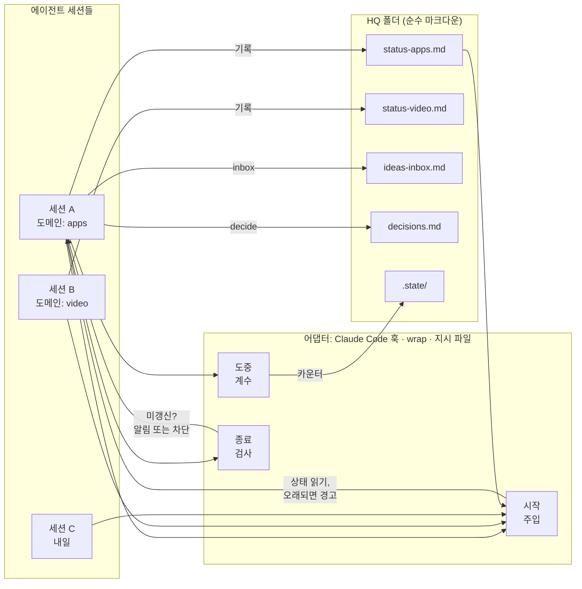

# session-hq

**에이전트 세션을 다섯 개 돌린다. 그런데 어느 세션도 다른 세션이 어제 무엇을 했는지 모른다.**

session-hq는 AI 코딩 에이전트 세션들을 위한 파일 기반 공유 본부(HQ)다. Claude Code, Codex,
Gemini CLI, Cursor, aider, 혹은 셸에서 돌리는 로컬 모델까지 — 도메인마다 마크다운 상태 파일 하나를
두고, 세션 시작 시 읽고 세션 종료 시 기록한다.

**상태: 0.2 — 초기 단계. 만든 사람이 매일 쓰고 있으며, API는 바뀔 수 있다.**

<details>
<summary><b>한눈에</b> — 아래 항목은 전부 이 저장소에서 직접 확인할 수 있다</summary>

- **의존성 없음.** `package.json` 자체가 없다. 설치할 것도 없고, Claude Code가 이미 요구하는
  Node 18 이상이면 된다.
- **네트워크 호출 없음, 텔레메트리 없음.**
  `grep -rE "fetch\(|https?://|node:https?|node:net" scripts/` 결과가 비어 있다.
- **읽는 환경 변수는 자기 것 네 개뿐:** `HQ_ROOT`, `HQ_DOMAIN`, `HQ_MEMORY_DIR`,
  `CLAUDE_PLUGIN_ROOT`. 자격 증명이나 다른 설정은 읽지 않는다.
  (`grep -roE "env\.[A-Z_]+" scripts/`)
- **쓰기는 HQ 루트 안에서만:** `hq.config.json`, `status-<domain>.md`, `ideas-inbox.md`,
  `decisions.md`, `dispatches.md`, `.state/<session-id>.json`, `dashboard.html`, 그리고
  `dashboard --eject`를 실행했을 때만 `dashboard.css`와 `dashboard.template.html`. 그 밖에는
  `dashboard --html`에 직접 지정한 파일뿐이다. (`grep -rn "writeFileSync\|mkdirSync" scripts/`)
- **외부 프로세스는 요청할 때만 실행한다:** `wrap`의 `--` 뒤에 쓴 명령, 그리고 `dashboard`가
  `--no-open`을 주지 않으면 여는 기본 브라우저. (`leak-check`은 `git ls-files`도 부른다.)
- **테스트 147개.** 네트워크도, 저장소에 넣어 둔 픽스처도 없다: `node --test`.
- **CI:** ubuntu·macos·windows × Node 18·22 — `.github/workflows/test.yml`.
- **Windows 11과 Linux에서 직접 검증**했다. Windows 11은 Claude Code 2.1.x로 실제 설치와 훅 실행까지,
  Linux는 WSL Ubuntu·Node 22에서 전체 테스트와 `init`, `wrap`의 종료 코드 전파, `dashboard`까지
  돌렸다. macOS는 CI 매트릭스로만 커버한다.
- **어댑터 세 가지:** Claude Code 훅(자동), `hq.mjs wrap`(모든 에이전트 CLI), 지시 파일(강제가
  아니라 관행). 각각 무엇을 보장하는지는 [docs/adapters.md](docs/adapters.md)에 있다.
- **MIT 라이선스.** 보안 메모와 신뢰 경계는 [docs/security.md](docs/security.md).

</details>

[English](README.md) · [한국어](README.ko.md)
[](https://github.com/lji151/session-hq/actions/workflows/test.yml)

---

## 왜 필요한가

세션 하나에서 전부 돌릴 수도 있다. 그러면 두 군데서 탈이 난다. 상관없는 작업이 뒤섞이고 컨텍스트가
계속 불어나면서 품질이 떨어진다 — 썸네일을 묻는데 모델은 아침에 잡던 결제 버그를 아직 안고 있다.
그리고 컨텍스트 압축이 언젠가 정작 필요한 것을 지워 버린다. 두 번째 문제는 세컨드 브레인이 덜어 준다.
노트 볼트든 메모리 파일을 담은 git 저장소든, 컨텍스트 창 밖에 남기만 하면 된다. session-hq가 그
자리를 대신하지는 않으니, 세컨드 브레인은 세컨드 브레인대로 갖춰 두는 게 맞다.

그래서 나눈다. 프로젝트당 하나든 도메인당 하나든, 각자 편한 기준으로 자르면 된다. 뒤섞임은 사라지고
세션마다 초점이 살아난다.

그런데 다섯 번째나 여섯 번째 세션쯤에서 다른 문제가 나타난다. 고장 난 데는 없다. 세션마다 제 일을 잘
하고 있다. 다만 그 전체가 더 이상 눈에 들어오지 않는다 — 무엇이 멈춰 있는지, 무엇이 내 답을 기다리는지,
일주일째 아무도 손대지 않은 게 무엇인지. 전부 어딘가에 있기는 한데, 머릿속에 담기에는 창이 너무 많다.

session-hq가 푸는 것은 이 세 번째 문제다. 세션마다 한곳에 보고하고, 한 화면이 그 전부를 보여 준다.

구조로 보면 조직도다. 세션 하나하나가 자기 부서를 굴리는 부서장이고, 그 분야는 당신보다 훨씬 잘 안다.
HQ는 그들이 올리는 보고서다 — 무엇이 멈췄고, 무엇이 막혔고, 아무도 집어 들지 않았는지를 대표가 확인하는
그 문서. 모든 부서 회의에 들어가 앉고 싶은 사람은 없다. 보고서를 원할 뿐이다. `hq.mjs dashboard`가
그 보고서다.

## 60초 데모

훅 덕분에 자동으로 도는 Claude Code 기준 화면이다. 다른 에이전트도 [`wrap`](docs/adapters.md)이나
각자의 지시 파일로 똑같은 프로토콜을 돌린다.



<sub>같은 화면을 아래에 텍스트로도 옮겨 두었다.</sub>

```console
$ claude
──────────────────────────────────────────────────────────────────────────────
## session-hq — HQ status for this session

Domain: **apps**   ·   HQ root: `~/hq`
Last updated 19h ago (from stamp).

### 결제 재시도 큐
- 상태: 재시도는 정상 동작하나, dead-letter 경로에서 원본 에러가 유실됨.
- 다음: queue/retry.ts:88 의 DeadLetter.record() 에 에러 필드 추가
- 대기: 없음
- 배제됨: 직렬화 문제 아님 — enqueue 시점에는 필드가 있고 워커의
  structuredClone 이후 사라짐. 양쪽에서 diff 로그로 확인함.
- 갱신: 2026-01-30 (apps)
──────────────────────────────────────────────────────────────────────────────

> 재시도 큐 건, 이어서 해줘

이전 세션의 조사 결과를 가지고 있습니다. 필드가 enqueue 는 통과하고 워커에서
사라지므로 직렬화 문제는 배제된 상태입니다. 바로 DeadLetter.record() 부터
보겠습니다.

  … 40분간 작업 …

> 오늘은 여기까지

  session-hq: this session used 34 tools but `status-apps.md` is unchanged.
  Append what happened — outcome, next step, blockers, and anything you ruled
  out — then stop. Negative results matter: they stop the next session
  repeating your work.

> /hq-update

`status-apps.md` 갱신:
  - 상태: 수정 완료. record() 가 원본 에러를 전달하며 픽스처 통과.
  - 배제됨: 재시도 백오프는 무관 — 수정 전후 타이밍이 동일함.
```

이 도구의 값을 혼자 다 하는 항목이 **배제됨(Ruled out)** 이다. 어느 세션이나 가장 건너뛰고 싶어 하는
줄이면서, 세 세션이 각자 똑같은 막다른 길을 다시 밟는 것을 막아 주는 유일한 줄이기도 하다.

## 무엇인가

마크다운 파일이 담긴 폴더 하나와 의존성 없는 Node CLI 하나. 이 둘이 제품의 전부이고, Claude Code
플러그인은 그 위에 얹은 어댑터 하나일 뿐이다.

```
~/hq/
  hq.config.json      주기와 레이아웃 설정
  status-video.md     도메인별 파일 하나 — 한 세션이 통째로 다루게 되는 작업 갈래
  status-apps.md
  status-business.md
  ideas-inbox.md      아이디어 한 줄씩. 약속이 아니다
  decisions.md        결정 한 줄씩. 추가만 하고 수정하지 않는다
  .state/             어댑터가 쓰는 세션별 기록. 사람이 읽을 것은 아니다
```

상태 파일은 작업 갈래마다 `###` 블록 하나씩이고, 각 블록에 다섯 개 항목이 들어간다.

```
### 결제 재시도 큐
- 상태: 실제로 어디까지 왔는지 한 줄. "X 작업함"은 상태가 아니라 근무일지다
- 다음: 파일·명령어·사람 중 하나. "이어서 진행"은 안 된다
- 대기: 무엇이 누구를 기다리는지. "없음"도 유효한 답이다
- 배제됨: 시도했는데 안 된 것과 그 근거
- 갱신: YYYY-MM-DD (어느 세션인지)
```

**핵심은 배제됨이다.** 세 세션이 각각 40분씩 같은 플랫폼 제약을 다시 발견하는 건, 30초면 적을 수 있는
한 줄 때문에 두 시간을 날리는 일이다. 지운 가설은 반드시 근거와 함께 적는다 — 에러 메시지, 측정값,
비교 결과. 제대로 확인한 건지 판단이 안 되는 사람은 어차피 처음부터 다시 확인하기 때문이다.

상태 파일 옆에는 `ideas-inbox.md`(아이디어를 날짜와 함께 한 줄씩. 약속이 아니라는 점을 분명히 해 둔다)와
`decisions.md`(결정을 날짜와 함께 한 줄씩. 추가만 하며, 번복도 수정이 아니라 새 줄로 적는다. 이 파일의
가치는 일이 벌어진 순서에 대해 정직하다는 데 있다)가 함께 놓인다.

그냥 마크다운이라 다른 세션에 닿기만 하면 어디에 두든 상관없다. git 저장소, 동기화 드라이브, 노트 볼트
무엇이든 된다. 데이터베이스도 데몬도 네트워크도 필요 없다.

## 빠른 시작

### Claude Code

```bash
claude plugin marketplace add lji151/session-hq
claude plugin install session-hq@session-hq
```

`/hq-init` — 질문 세 개에 답하면 끝, 그다음 Claude Code 재시작 — 그리고 `/hq-dashboard`.

### 그 외 모든 에이전트

```bash
git clone https://github.com/lji151/session-hq
node session-hq/scripts/hq.mjs init
node session-hq/scripts/hq.mjs wrap --domain <d> -- <agent>
node session-hq/scripts/hq.mjs dashboard
```

대부분에게는 이게 전부다. `wrap`의 옵션, CLI로 감쌀 수 없는 도구를 위한 지시 파일 관행, 그 밖의
모든 플래그는 [docs/adapters.md](docs/adapters.md)와 [docs/config.md](docs/config.md)에 있다.

## 동작 방식



무엇이 촉발하든 지점은 세 군데다.

1. **시작** — 해당 세션의 `status-<domain>.md`를 `inject.maxLines`만큼 잘라 컨텍스트에 넣는다.
   `inject.staleAfterHours`보다 오래되었으면 경고 배너가 붙는다.
2. **도중** — 활동량을 `.state/<session-id>.json`에 센다. 덕분에 "아무것도 안 한 세션"과 "서른네 가지를
   해 놓고 하나도 안 적은 세션"이 구분된다. 개별 툴 호출까지 볼 수 있는 건 Claude Code 훅뿐이고,
   `wrap`은 대신 경과 시간을 쓴다.
3. **종료** — 상태 파일을 세션 시작 시점의 해시와 비교한다. 실제로 작업을 했는데 그대로면 알림이 뜨고,
   설정에 따라서는 차단된다.

**어떤 어댑터도 상태 내용을 대신 써 주지 않는다.** 파일을 만들고, 읽고, 물어볼 뿐이다. 내용은 그 작업을
실제로 한 세션에서 나온다. 자동으로 채운 항목은 그럴듯하게 들리기만 하는 항목이고, 그런 게 하나만 섞여도
파일 전체가 신뢰를 잃는다.

### 한 화면에서 전부 보기

도메인이 다섯 개쯤 되면 전체 그림을 머릿속에 담아 둘 수 없다. `hq.mjs dashboard` — 또는
`/hq-dashboard` — 는 페이지 하나를 만들어 열어 주고, 다른 무엇보다 먼저 정작 궁금한 것 —
*내가 무엇을 놓쳤나* — 에 답한다.

<sub>같은 그림을 텍스트로, 터미널이나 스크린 리더용 (`dashboard --terminal`):</sub>

```console
$ node scripts/hq.mjs dashboard --terminal

session-hq dashboard — ~/hq
3 domains · stale after 48h · generated 2026-02-04 09:12 UTC

DOMAIN    LAST UPDATED       WORK  BLOCKED  NEXT
--------  -----------------  ----  -------  ----
video     6d ago    ⚠ STALE     3        1     3
apps      3h ago                4        1     4
business  just now              0        0     0

STALE (> 48h)
  video        6d ago

BLOCKED
  video · Platform A collapse — support ticket response, opened five days ago
  apps · Shoreline store submission — platform review, outside our control

UNTOUCHED
  business (no workstreams yet)

INBOX  6 ideas waiting
LATEST DECISIONS
  2026-01-28 | export ships without streaming; revisit above 20 MB | apps
  2026-01-30 | a 50-unit sample before any volume order | business
  2026-01-31 | cold opens replace framing intros | video
```

서버도, 포트도, 페이지 안 스크립트도 없다 — 다시 실행하면, 또는 `--watch`를 붙이면 계속 재생성되는
HTML일 뿐이다. 그 밖의 모든 화면과 플래그는 [docs/config.md](docs/config.md#the-dashboard)에 있다.

### 내 것으로 만들기

대부분은 스타일시트가 아니라 단어 하나를 원한다. `dashboard --theme paper` — 또는 `auto`,
`terminal`, `slate` — 하나로 전체 인상이 바뀌고, `hq.config.json`에
`"dashboard": { "theme": "paper" }`를 넣으면 그 선택이 계속 유지된다. 같은 블록에 강조색, 글꼴,
조밀한 밀도, 어떤 섹션을 어떤 순서로 보여 줄지, 그리고 한국어 페이지를 위한 `"labels": "ko"`가 함께
들어 있다. 그래도 부족하면 `dashboard --eject`가 실제로 쓰이는 템플릿과 CSS를 그대로 꺼내 주니 직접
고치면 된다 — 세 단계 전부는 [docs/dashboard.md](docs/dashboard.md)에 있다.

### 대표 자리에 앉는 두 가지 방법

**직접 본다.** 페이지가 필요할 때 `hq.mjs dashboard`나 `/hq-dashboard`를 돌리면 된다. 필요할 때만,
선택적으로. 세션도 따로 필요 없다.

**또는 에이전트가 하루 종일 본다.** *오케스트레이터 세션*은 도메인이 `orchestrator.domain`(기본값
`hq`)인 세션 하나를 말한다. 상태 파일 하나가 아니라 HQ 전체를 주입받으며, 각 부서가 무엇을 했는지 알고,
일을 배분하고, 결정을 기록하고, 결과가 사람에게 가기 전에 검토하는 것이 그 역할이다.

```console
$ HQ_DOMAIN=hq claude
──────────────────────────────────────────────────────────────────────────────
## session-hq — orchestrator session

| Domain   | Last updated | Workstreams | Blocked | Next |
| video    | 6d ago STALE |           3 |       1 |    3 |
| apps     | 3h ago       |           4 |       1 |    4 |
| business | just now     |           0 |       0 |    0 |
──────────────────────────────────────────────────────────────────────────────

> 오늘 내가 봐야 할 게 뭐야

두 가지입니다. **business**는 작업 항목이 아예 없습니다 — 만들어 놓고 쓰지 않은 상태라,
정리하시든지 여기에 무엇이 들어가야 하는지 알려 주셔야 합니다. **video**는 지원 티켓을
열어 둔 채로 6일째 조용합니다. 후속 조치를 그쪽 Next 줄에 적어 두었으니 그 세션이 다음에
열릴 때 집어 갑니다.

나머지는 잘 굴러가고 있습니다. apps는 목요일에 익스포트를 출시했습니다.
```

이 방식이 성립하는 이유는 하나다. **어느 부서 세션을 닫아도 잃는 게 없다.** 오케스트레이터가 읽은 것은
그 세션이 아니라 그 세션이 남긴 파일이기 때문이다. 세션은 소모품이 되고, 기록은 남는다.

### 한자리에서 부서들을 돌리기

세션마다 열어서 직접 타이핑하는 대신 오케스트레이터에게 말하면 된다. 요청은 `dispatches.md`에 남고,
해당 부서 세션이 다음에 열릴 때 그걸 집어 가 결과를 보고하며, 그 결과를 오케스트레이터가 검토한다.

```console
$ HQ_DOMAIN=hq claude

> video 세션한테 인트로 로고 수정본으로 다시 렌더하라고 해줘

d-4f0c21로 video에 전달했습니다(높은 우선순위). dispatches.md에 기록되어 있어서 그
세션이 다음에 열릴 때 받아 갑니다 — 마침 video 세션이 살아 있길래 해당 id를 가리키는
메시지도 함께 보냈습니다.

  … 다음 날 아침 …

> 검토할 거 있어?

하나 있습니다. video가 d-4f0c21을 마쳤습니다: "세 컷 모두 재렌더, 각각 로고 정상;
소스 프로젝트 커밋함". 출력 파일 세 개가 오늘 타임스탬프로 존재하는지 확인했습니다.
승인 처리하겠습니다.
```

기록은 디스크에 남은 dispatch 쪽이고, 살아 있는 세션에 보내는 메시지는 조금 더 빨리 눈에 띄게 하는
수단일 뿐이다. 메시지가 실제로 전달되는지는 하네스가 알아서 할 일이고, HQ가 보장하는 건 요청과 결과가
디스크에 남는다는 것뿐이다. 그래서 사흘 전에 닫아 둔 부서 세션에도 이 방식이 통한다.

부서 세션은 자기 상태 파일보다 먼저, 주입되는 내용 맨 위에서 열려 있는 dispatch를 본다. 마무리는
`hq.mjs done <id> --note "<결과>"`로 한다. 오케스트레이터의 대기열은 대시보드의 **Awaiting review**
목록이다.

### 각자 방식대로 쓰기

위의 어느 것도 정해진 워크플로가 아니다. 고정된 건 상태 파일 형식 하나뿐이고, 세션을 어떻게 나눌지도
HQ를 어떻게 볼지도 전부 취향껏 돌릴 수 있는 다이얼이다. `hq.mjs init --profile <단어>` (또는 `init`이
묻는 세 번째 질문)가 알림 주기를 대신 정해 준다. 실제로 쓰이는 여섯 가지 형태를 적어 둔다.

**혼자, 가시성만.** `--profile gentle` — 프로젝트당 세션 하나, 세션 끝에 부드러운 알림 한 번,
오케스트레이터 없음. 페이지가 필요할 때 `hq.mjs dashboard`를 돌린다. 기본 설치 상태이며 대부분에게는
이것으로 충분하다.

**오케스트레이터 주도.** `--profile orchestrator` — `HQ_DOMAIN=hq`인 조율 세션 하나가 HQ 전체를
주입받고 `dispatch` / `done` / `ack`을 쓴다. 부서 세션은 자유롭게 닫고 다시 연다 — 기록이 디스크에
있으므로 세션이 사라져도 잃는 것이 없다.

**엄격한 인수인계 (팀).** `--profile strict` — 기록 없이는 세션이 끝나지 않는다. HQ 폴더를 공유 git
저장소에 두고, `decisions.md`를 팀의 결정 로그로 쓴다. 다른 파일처럼 PR에서 리뷰된다.

**습관 들이기.** `--profile coaching` — 습관이 잡힐 때까지 도구 호출 40번마다 알림. 아무도 알림이
필요 없어지면 `--profile gentle`로 되돌린다.

**여러 에이전트·로컬 모델 혼용.** Claude Code는 플러그인 훅으로, 나머지는 `hq.mjs wrap`이나 지시
파일로 — HQ는 하나만 둔다. 컨텍스트 창이 작으면 `inject.maxLines`를 낮추고(8k 창에서 15~25),
오케스트레이터 자리에는 `orchestrator.injectDashboard: false`를 쓴다.

**기준은 마음대로.** 도메인은 프로젝트일 수도, 고객사일 수도, 생활 영역일 수도, 그냥 `work` 하나일
수도 있다. `hq.config.json`의 `domains`를 고치고 해당 `status-<domain>.md` 파일 이름만 바꾸면 끝이다.
그 이름이 무엇을 뜻하는지는 나머지 어디서도 신경 쓰지 않는다.

첫 번째부터 시작하면 된다. 인수인계를 한 번 놓치고 아쉬워졌을 때, 그때 다이얼을 늘려도 늦지 않다.

## 주기 설정

작업 방식에 맞지 않는 잔소리는 결국 꺼 버리게 되고, 그러면 체계 전체가 썩는다. 그래서 주기는 일급 설정
으로 뒀다 — `hq.mjs init --profile gentle|coaching|strict`로 고르거나 (또는 `init`이 묻는 세 번째
질문으로), 아니면 HQ 루트의 `hq.config.json`에 직접 설정한다.

```json
{
  "hqRoot": "~/hq",
  "domains": ["video", "apps", "business"],
  "defaultDomain": null,
  "inject":    { "on": "session-start", "maxLines": 60, "staleAfterHours": 48 },
  "update":    { "mode": "on-stop", "everyNTools": 0, "minMinutesBetween": 20, "enforce": false },
  "inbox":     { "file": "ideas-inbox.md" },
  "decisions": { "file": "decisions.md" },
  "language":  "en"
}
```

| 키 | 값 | 역할 |
|---|---|---|
| `inject.on` | `session-start` · `session-start+compact` · `off` | 상태 파일을 언제 주입할지. `+compact`는 컨텍스트 압축 후에도 유지된다 — 긴 세션이 맥락을 잃는 지점이 대개 여기다. |
| `inject.maxLines` | 정수 | 주입 분량 상한. 긴 파일은 잘리고 원본 파일 위치가 안내된다. |
| `inject.staleAfterHours` | 숫자 | 이보다 오래되면 "의존하기 전에 검증하라"는 배너가 붙는다. |
| `update.mode` | `on-stop` · `periodic` · `manual` | `on-stop`: 종료 시 검사. `periodic`: 작업 중 알림. `manual`: 알림 없음, 명령어만. |
| `update.everyNTools` | 정수 | `periodic` 전용. N번의 툴 호출마다 알림. `0`이면 비활성. |
| `update.minMinutesBetween` | 숫자 | `periodic` 전용. 알림 사이의 최소 간격. 툴 호출이 몰려도 알림이 몰리지 않게 한다. |
| `update.enforce` | 불리언 | `on-stop` 전용. `false`(기본값)는 알림, `true`는 파일을 갱신할 때까지 종료를 **차단**한다. |
| `language` | `en` · 임의의 태그 | 생성되는 템플릿의 언어 힌트. |

실제로 쓰이는 세 가지 설정이자, 각각 프로필 이름이기도 하다:

- **`gentle`** — `mode: "on-stop"`, `enforce: false`. 종료 시 알림 한 번, 무시해도 된다. 기본값이다.
- **`coaching`** — `mode: "periodic"`, `everyNTools: 40`, `minMinutesBetween: 20`. 팀이 습관을 들이는 동안 유용하다.
- **`strict`** — `mode: "on-stop"`, `enforce: true`. 기록하지 않으면 세션이 끝나지 않는다. 인수인계 누락이
  다른 사람의 오전을 통째로 날리는 공유 저장소에 적합하다. Stop 훅의 차단 결정을 사용하며, 실제로 그만큼
  성가시게 느껴진다.

**컨텍스트 창이 작은 로컬 모델을 쓴다면** 만질 값은 `inject.maxLines`다. 기본값 60은 컨텍스트가 큰
호스팅 모델에 맞춘 값이라, 8k 창이라면 15~25쯤이 정작 작업에 쓸 예산을 잡아먹지 않으면서 인수인계를
쓸모 있게 유지한다. 나머지 절반은 상태 파일 자체를 짧게 유지하는 것이고, 이건 어차피 해 둘 만하다.

전체 레퍼런스: [docs/config.md](docs/config.md).

## 스킬로 제공되는 두 가지 관행

상태 파일이 메커니즘이라면, 아래 둘은 그것을 쓸 만하게 만드는 관행이다.

**[layered-memory](skills/layered-memory/SKILL.md)** — `MEMORY.md` → `index-<domain>.md` → 파일 하나당
사실 하나. 세션은 자기 작업에 해당하는 인덱스만 읽고 나머지는 읽지 않으므로, 기억의 비용이 전체 분량이
아니라 관련성에 비례하게 된다. 프론트매터 스키마, 분류 우선 규칙, 6주 뒤에도 그 지시가 무시되지 않게
하는 Why / How-to-apply 형식을 포함한다. 점검은 `node scripts/hq.mjs memory-lint`(또는 `/memory-lint`).

린트는 메모리 디렉터리를 읽기만 하고 아무것도 쓰지 않는다. 빠졌거나 부실한 프론트매터, 어디에서도
링크되지 않은 파일, 도달할 수 없는 도메인 인덱스, 사실 하나를 넘어 비대해진 파일을 보고하며, 0.4.0에서
검사 하나와 선택형 참고 항목 하나가 추가됐다.

- **링크 무결성** — 디렉터리 안의 어떤 파일에도 닿지 않는 `[[name]]`. 파일 이름을 바꾸면 그것을 가리키던
  파일마다 남는 흔적이다. 타입 접두어를 붙인 후보가 정확히 하나면 그 이름을 알려 준다: *did you mean
  `[[feedback-episode-length]]`?* 프론트매터 `name`이 파일명과 다른 경우도 같은 이유로(그 이름으로 건 링크는
  풀리지 않는다) 함께 보고한다. warn 레벨.
- **값 드리프트** (`--drift`, **기본 꺼짐**) — 같은 파라미터가 파일마다 다른 숫자로 적혀 있는 경우:
  `value drift: "gate °C" = 55 (a.md), 72 (b.md)`. 각 파일이 저마다 멀쩡하기 때문에 다른 검사로는 보이지
  않는 종류의 고장이고, 하드웨어 온도 게이트가 여덟 개 파일에 일곱 가지 값으로 적혀 있던 것을 손으로
  발견한 뒤에 넣었다. **휴리스틱 참고용**이고, 기본으로 꺼 둔 이유가 있다. 디렉터리가 커지면 단어와 단위만
  우연히 겹친 무관한 숫자 쌍이 상당수 섞인다. `info` 레벨이라 린트를 실패시키지 않으며, 목록은 10개에서
  끊고 몇 개를 접었는지 한 줄로 알려 준다. `--drift-min-files <n>`(기본 2)은 최소 n개 파일에서 어긋난
  것만 보고하므로, 목록이 지저분할 때 가장 빠르게 줄이는 방법이다.

**[orchestrator-routing](skills/orchestrator-routing/SKILL.md)** — 코디네이터가 지시서를 쓰고 결과를
검토하며, 구현과 리서치는 다른 계층에 위임하는 구조. 지시서 템플릿과 "보여주기 전 검토" 체크리스트를
포함한다. 요약하자면, 검토 없는 위임은 위임이 아니라 그냥 일을 옮긴 것이다.

**[hq-protocol](skills/hq-protocol/SKILL.md)** 이 세 번째다. 언제 읽고 언제 쓰는지, 제대로 된 상태 항목에
무엇이 들어가는지, 오래된 파일과 충돌하는 항목을 어떻게 다루는지를 다룬다.

셋 다 Claude Code 플러그인이 알아서 띄울 수 있도록 스킬 형식으로 포장했을 뿐, 본문에는 Claude에
종속된 내용이 없는 마크다운 한 장이다. 다른 에이전트에게 그 파일을 그대로 가리켜도 되고, 시스템
프롬프트에 붙여 넣어도 된다.

## Claude Code를 쓴다면

기본 기능들과 어떻게 나란히 놓이는지, 과장 없이 정리하면 이렇다.

| | 범위 | 수명 |
|---|---|---|
| **세션 간 메시징** (기본 기능) | 지금 동시에 돌고 있는 세션들 사이 | 실시간, 휘발성 |
| **session-hq** | 며칠에 걸친 세션들 사이 | 영속적, 비동기 |
| **자동 메모리** (기본 기능) | 한 프로젝트에 대한 사실 | 프로젝트 단위 |
| **session-hq** | 여러 프로젝트에 걸친 현재 상태 | HQ 하나, 도메인 여럿 |

경쟁이 아니라 보완이다. 기본 메시징은 옆 세션에게 지금 당장 물어보는 수단이고, session-hq는 그 세션이
지난주에 무슨 결론을 냈는지 알아내는 수단이다. 자동 메모리는 *이 저장소*가 어떻게 돌아가는지를 기억하고,
HQ는 저장소 전체를 통틀어 지금 무슨 일이 벌어지는지를 기억한다. 프로젝트 하나에 세션 하나만 돌린다면
아마 필요 없다.

## 다른 방식과 비교하면

제품 이름이 아니라 범주로 적는다. 중요한 질문은 무엇을 저장하고 누가 읽느냐이지, 어느 회사 것이냐가
아니기 때문이다. 아래 중 몇 가지는 session-hq와 같이 쓰면 좋다.

| | 무엇을 저장하나 | 누가 읽나 | 수명 | 하지 않는 것 |
|---|---|---|---|---|
| **프로젝트별 자동 메모리** | 저장소 하나에 대한 지속적 사실 | 에이전트가 자동으로 | 프로젝트가 살아 있는 동안 | 프로젝트를 가로지르기, 진행 중인 일 추적 |
| **세션 메모리·회상 도구** | 지난 대화, 검색 가능한 형태 | 에이전트가 질의할 때 | 몇 달 치 기록 | 지금 무엇이 멈췄고 막혔는지 알려 주기 |
| **관측(옵저버빌리티) 대시보드** | 트레이스, 토큰 수, 지연 시간 | 사람이 사후에 | 보존 기간까지 | 그 작업이 무슨 결론을 냈는지 말해 주기 |
| **실시간 세션 간 메시징** | 돌고 있는 세션들 사이의 메시지 | 세션들이 그 순간에 | 세션이 끝날 때까지 | 닫힌 세션 너머까지 남기 |
| **session-hq** | 도메인별 현재 상태: 진행·대기·배제됨·dispatch | 모든 세션이 시작 시, 사람은 `dashboard`로 | 누군가 고칠 때까지 | 대화 기록·트레이스·저장소별 지속 사실 보관 |

가장 중요한 건 마지막 줄이다. session-hq가 담는 것은 *현재 상태*이고, 일부러 압축해서 사람이 손으로
적는다. 아카이브도, 트레이스 저장소도, 메모리 인덱스도 아니다 — [하지 않는 것](#하지-않는-것)을 보고,
대화 기록을 남기고 싶다면 [recipes/conversation-archiver.md](recipes/conversation-archiver.md)를
참고할 것.

## 하지 않는 것

- **다중 계정 관련 기능은 없다.** 이것은 계정 하나에 세션 여럿인 상황을 위한 것이다. 사용량 제한을
  우회하는 기능은 없고, 추가 요청도 받지 않는다.
- **API 프록시, 트래픽 수준의 모델 라우팅, 요청 가로채기 없음.** (`orchestrator-routing` 스킬은
  위임할 때 어느 계층에 맡길지 고르는 프롬프트 수준의 관행이지, 네트워크 계층이 아니다.)
- **의존성 없음.** Node 18 이상 외에는 아무것도 필요 없다. 네이티브 모듈도, 설치 단계도, 데몬도 없다.
- **자동 작성 없음.** 어댑터는 알릴 뿐, 상태 항목을 지어내지 않는다.
- **아카이브가 아니다.** HQ는 현재 상태만 담는다. 전체 대화 기록은
  [recipes/conversation-archiver.md](recipes/conversation-archiver.md)를 참고할 것.
- **다른 도구의 내부 동작에 대해서는 아무것도 주장하지 않는다.** `wrap`과 지시 파일 방식은 명령을
  실행하고 정중히 부탁하는 것으로 동작한다. 다른 도구에 자체 훅이 있다면 그걸 이용한 어댑터 기여를
  환영한다 — [CONTRIBUTING.md](CONTRIBUTING.md) 참고.

## 레시피

HQ와 잘 어울리는 패턴들이다. 남의 인프라를 통째로 물려받는 대신 각자 상황에 맞게 고쳐 쓸 수 있도록,
코드가 아니라 레시피 문서로 둔다.

- [notifier-telegram.md](recipes/notifier-telegram.md) — 상태 변화를 채팅으로 푸시
- [deadline-reminder.md](recipes/deadline-reminder.md) — Windows·macOS·Linux 예약 리마인더
- [conversation-archiver.md](recipes/conversation-archiver.md) — 대화 기록 아카이브
- [screen-look.md](recipes/screen-look.md) — 세션이 화면을 볼 수 있게 하기

## 문서

- [docs/adapters.md](docs/adapters.md) — 어댑터 세 종류, 각각이 보장하는 것, 새로 만드는 법
- [docs/design.md](docs/design.md) — 문제 정의, 아키텍처, 설계상의 트레이드오프
- [docs/config.md](docs/config.md) — 모든 설정 키와 `init`/`wrap`/`dashboard` 레퍼런스
- [docs/dashboard.md](docs/dashboard.md) — 테마, `dashboard` 설정 블록, 라벨, 템플릿 슬롯
- [docs/case-studies.md](docs/case-studies.md) — 이것이 없을 때 무엇이 잘못되는지에 대한 사례 세 편
- [docs/security.md](docs/security.md) — 무엇이 실행되는지, 신뢰 경계, 제보 방법
- [llms.txt](llms.txt) — 같은 지도를 한 파일로. 저장소를 요약하려는 사람(또는 도구)을 위한 것

## 어떻게 만들었나

여기 담긴 프로토콜과 운영 방식은 책상에서 나온 것이 아니다. 여러 에이전트 세션을 병렬로 돌리면서 HQ
폴더를 몇 달간 손으로 관리한 데서 나왔고, 다섯 항목 형식·필수 `배제됨` 줄·도메인별 파일·dispatch
대기열은 전부 그것이 없어서 대가를 치른 적이 있기 때문에 존재한다.

코드는 Claude Code를 오케스트레이터로 두고 썼다. 만든 사람이 지시하고 검토하며, 코딩 계층 에이전트가
문서화된 지시서에 따라 구현하고, 커밋 전마다 테스트와 leak-check를 통과시켰다. 이 저장소는 스스로
권하는 방식 그대로 만들어졌고, 그것이 그 권고가 실제로 통하는지 확인하는 가장 정직한 시험이기도 하다.

## 기여

[CONTRIBUTING.md](CONTRIBUTING.md)를 참고할 것. PR을 열기 전에 `node --test`와
`node scripts/leak-check.mjs --denylist <자신의 denylist>`를 실행한다.

## 라이선스

MIT — [LICENSE](LICENSE) 참조.
