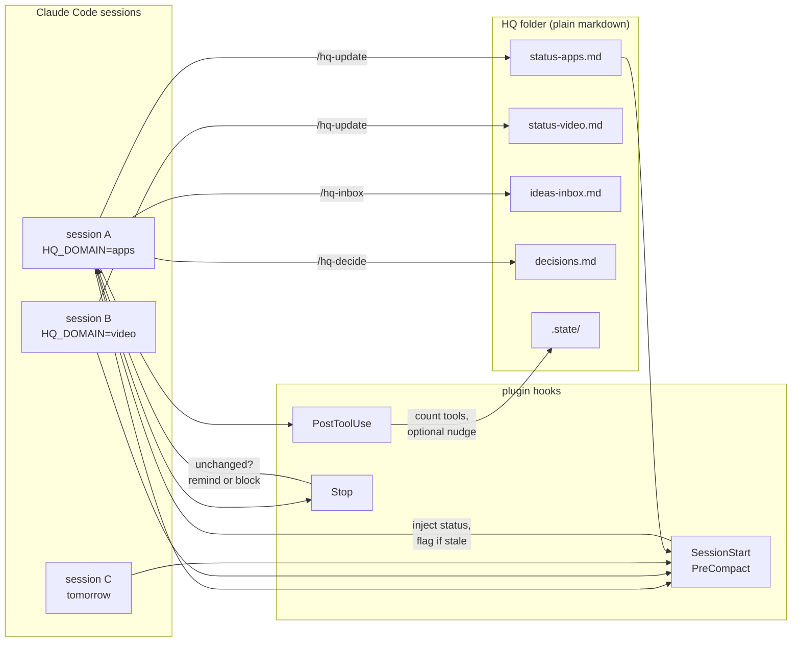

# session-hq

**You run five Claude Code sessions. None of them knows what the others did yesterday.**

session-hq gives them a shared, file-based headquarters: one markdown file per domain that every
session reads at start and updates at end, plus an ideas inbox and a decision log — enforced by
hooks, at a cadence you choose.

[English](README.md) · [한국어](README.ko.md)

---

## 60 seconds

```console
$ claude
──────────────────────────────────────────────────────────────────────────────
## session-hq — HQ status for this session

Domain: **apps**   ·   HQ root: `~/hq`
Last updated 19h ago (from stamp).

### Payment retry queue
- Status: retries land, but the dead-letter path drops the original error.
- Next: add the error field to DeadLetter.record() in queue/retry.ts:88
- Blocked on: nothing
- Ruled out: not a serialisation bug — field present at enqueue, gone after the
  worker's structuredClone. Confirmed with a logged diff on both sides.
- Updated: 2026-01-30 (apps)
──────────────────────────────────────────────────────────────────────────────

> the retry queue thing — pick it up

I have the previous session's finding: the field survives enqueue and is lost in
the worker. That rules out serialisation, so I will go straight to
DeadLetter.record().

  … 40 minutes of work …

> thanks, that's it for today

  session-hq: this session used 34 tools but `status-apps.md` is unchanged.
  Append what happened — outcome, next step, blockers, and anything you ruled
  out — then stop. Negative results matter: they stop the next session
  repeating your work.

> /hq-update

Updated `status-apps.md`:
  - Status: fixed. record() now carries the original error; fixture green.
  - Ruled out: retry backoff was never involved — timings identical before/after.
```

<!-- TODO: replace with a recording -->


The line that pays for the whole plugin is **Ruled out**. It is the one every session is tempted
to skip, and the one that stops three sessions independently rediscovering the same dead end.

## Install

Requires Claude Code and Node ≥ 18. No other dependencies.

```bash
# Add this repo as a marketplace, then install the plugin from it
claude plugin marketplace add your-github-username/session-hq
claude plugin install session-hq@session-hq

# Or from a local clone
git clone https://github.com/your-github-username/session-hq
claude plugin marketplace add ./session-hq
claude plugin install session-hq@session-hq
```

Then, in Claude Code:

```
/hq-init
```

It asks which domains you want, creates `~/hq` with a config, a status file per domain, an ideas
inbox and a decision log, and tells you what to do next. **Restart Claude Code afterwards** —
hooks load at session start, so the session that ran `/hq-init` is still running without them.

Give each session a domain by exporting `HQ_DOMAIN` before launching it, or set `defaultDomain` in
`hq.config.json` if a machine mostly does one kind of work.

Check it with `claude plugin list`, `/hooks`, and `/hq-doctor`.

## How it works



Four moving parts:

1. **SessionStart** injects the session's `status-<domain>.md`, trimmed to `inject.maxLines`,
   with a staleness banner when the file is older than `inject.staleAfterHours`.
2. **PostToolUse** counts tool calls into `<hqRoot>/.state/<session-id>.json`, and in `periodic`
   mode emits a throttled nudge.
3. **Stop** checks whether the status file changed since the session started. If the session did
   real work and wrote nothing back, it says so.
4. **You** write the actual content, through `/hq-update`. The plugin never invents status.

The HQ is plain markdown in a folder you choose. Put it in a git repo, a synced drive, or a notes
vault — anything that gets it to the other sessions.

## Configure the cadence

Nagging that does not fit how you work gets turned off, and then the whole thing rots. So the
cadence is a first-class setting. `hq.config.json` at the HQ root:

```json
{
  "hqRoot": "~/hq",
  "domains": ["video", "apps", "business"],
  "defaultDomain": null,
  "inject":    { "on": "session-start", "maxLines": 60, "staleAfterHours": 48 },
  "update":    { "mode": "on-stop", "everyNTools": 0, "minMinutesBetween": 20, "enforce": false },
  "inbox":     { "file": "ideas-inbox.md" },
  "decisions": { "file": "decisions.md" },
  "language":  "en"
}
```

| Key | Values | What it does |
|---|---|---|
| `inject.on` | `session-start` · `session-start+compact` · `off` | When the status file is injected. `+compact` survives a context compaction, which is when a long session most often loses the thread. |
| `inject.maxLines` | integer | Injection budget. A long status file is truncated with a pointer to the full file. |
| `inject.staleAfterHours` | number | Older than this gets a "verify before you rely on it" banner. |
| `update.mode` | `on-stop` · `periodic` · `manual` | `on-stop`: check at the end. `periodic`: nudge during. `manual`: no reminders, commands only. |
| `update.everyNTools` | integer | `periodic` only. Nudge every N tool calls. `0` disables. |
| `update.minMinutesBetween` | number | `periodic` only. Floor between nudges, so a burst of tool calls does not produce a burst of nudges. |
| `update.enforce` | boolean | `on-stop` only. `false` (default) reminds. `true` **blocks** the stop until the file is updated. |
| `language` | `en` · any tag | Language hint for generated templates. |

Three cadences that people actually use:

- **Light** — `mode: "on-stop"`, `enforce: false`. One reminder at the end, ignorable. The default.
- **Coaching** — `mode: "periodic"`, `everyNTools: 40`, `minMinutesBetween: 20`. Useful while a
  team is building the habit.
- **Strict** — `mode: "on-stop"`, `enforce: true`. The session cannot end without writing back.
  Appropriate for shared repos where a missed handoff costs someone else a morning. It uses the
  Stop hook's blocking decision, and it will feel like it.

Full reference: [docs/config.md](docs/config.md).

## Two conventions, shipped as skills

The status files are the mechanism. These are the practices that make them worth having.

**[layered-memory](skills/layered-memory/SKILL.md)** — `MEMORY.md` → `index-<domain>.md` → one
fact per file. The session reads the index that matches its work and nothing else, so the cost of
remembering scales with relevance instead of volume. Includes the frontmatter schema, the
triage-first rule, and the Why / How-to-apply format that keeps a correction from being argued
away six weeks later. Audit an existing directory with `/memory-lint`.

**[orchestrator-routing](skills/orchestrator-routing/SKILL.md)** — a coordinator that writes
briefs and reviews output, with coding and research delegated to other tiers. Includes the brief
template and the review-before-showing checklist, whose short version is: delegation without
review is not delegation, it is just moving the work.

**[hq-protocol](skills/hq-protocol/SKILL.md)** is the third — when to read, when to write, what a
real status entry contains, and how to handle staleness and conflicting entries.

## How this relates to Claude Code's own features

Accurately, and without overclaiming:

| | Scope | Lifetime |
|---|---|---|
| **Cross-session messaging** (native) | between sessions running now | live, ephemeral — gone when the session ends |
| **session-hq** | between sessions across days | persistent, async — outlives the session that wrote it |
| **Auto-memory** (native) | facts about one project | per project |
| **session-hq** | state across many projects | one HQ, many domains |

They compose rather than compete. Native messaging is how you ask the session next door a
question right now; session-hq is how you find out what it concluded last Tuesday. Auto-memory
remembers how *this repo* works; the HQ remembers what is currently happening across all of them.
If you only ever run one session on one project, you probably do not need this plugin.

## Non-goals

- **No multi-account anything.** This is one account with many sessions. There is no feature here
  for working around usage limits, and requests to add one will be declined.
- **No API proxying**, no model routing, no traffic interception.
- **No dependencies** beyond the Node that Claude Code already requires. No native modules, no
  install step, no daemon.
- **No automatic writing.** The plugin reminds; it never fabricates a status entry. A status file
  is only worth reading if a human or a session that actually did the work wrote it.
- **Not an archive.** The HQ holds current state. For full transcripts see
  [recipes/conversation-archiver.md](recipes/conversation-archiver.md).

## Recipes

Patterns that pair well with an HQ, written as recipes rather than shipped as code, so you can
adapt them without inheriting anyone's infrastructure:

- [notifier-telegram.md](recipes/notifier-telegram.md) — push a status change to a chat
- [deadline-reminder.md](recipes/deadline-reminder.md) — scheduled reminders on Windows, macOS, Linux
- [conversation-archiver.md](recipes/conversation-archiver.md) — Stop hook to a markdown vault
- [screen-look.md](recipes/screen-look.md) — let a session see the screen

## Docs

- [docs/design.md](docs/design.md) — the problem, the architecture, and the tradeoffs
- [docs/config.md](docs/config.md) — every configuration key
- [docs/case-studies.md](docs/case-studies.md) — three stories about what goes wrong without this

## Contributing

See [CONTRIBUTING.md](CONTRIBUTING.md). Run `node --test test/` and
`node scripts/leak-check.mjs --denylist <your denylist>` before opening a PR.

## License

MIT — see [LICENSE](LICENSE).
