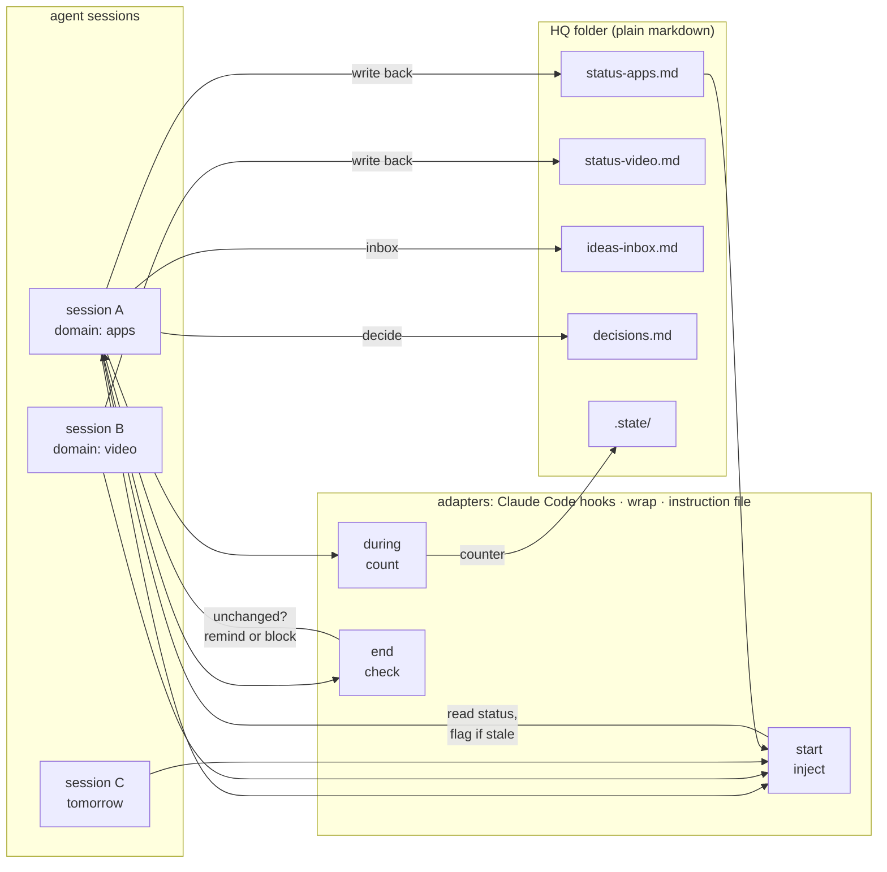

# session-hq

**You run five agent sessions. None of them knows what the others did yesterday.**

session-hq is a shared, file-based headquarters for AI coding-agent sessions — Claude Code, Codex,
Gemini CLI, Cursor, aider, or a local model in a shell — one markdown status file per domain, read
at session start, written at session end.

**Status: 0.1 — early, used daily by the author, APIs may move.**

<details>
<summary><b>At a glance</b> — every line below is checkable from this repo</summary>

- **No dependencies.** There is no `package.json`; nothing to install. Node ≥ 18, which Claude Code
  already requires.
- **No network calls, no telemetry.** `grep -rE "fetch\(|https?://|node:https?|node:net" scripts/`
  returns nothing.
- **Reads four environment variables, all its own:** `HQ_ROOT`, `HQ_DOMAIN`, `HQ_MEMORY_DIR`,
  `CLAUDE_PLUGIN_ROOT`. It reads no credentials and no other configuration.
  (`grep -roE "env\.[A-Z_]+" scripts/`)
- **Writes only inside the HQ root:** `hq.config.json`, `status-<domain>.md`, `ideas-inbox.md`,
  `decisions.md`, `dispatches.md`, `.state/<session-id>.json` — plus the file you name with
  `dashboard --html`. (`grep -rn "writeFileSync\|mkdirSync" scripts/`)
- **Runs one external process, only when asked:** the command you put after `--` in `wrap`.
  (`leak-check` also calls `git ls-files`.)
- **93 tests**, no network and no committed fixtures: `node --test`.
- **CI:** ubuntu, macos and windows on Node 18 and 22 — `.github/workflows/test.yml`.
- **Verified by hand on Windows 11** (Claude Code 2.1.x, live install and hook run) **and on Linux**
  (WSL Ubuntu, Node 22: full suite, `init`, `wrap` exit-code propagation, `dashboard`). macOS is
  covered by the CI matrix only.
- **Three adapters:** Claude Code hooks (automatic), `hq.mjs wrap` (any agent CLI), an instruction
  file (convention, not enforcement). [docs/adapters.md](docs/adapters.md) says what each guarantees.
- **MIT licensed.** Security notes and trust boundary: [docs/security.md](docs/security.md).

</details>

[English](README.md) · [한국어](README.ko.md)
[](https://github.com/lji151/session-hq/actions/workflows/test.yml)

---

## Why

You could run everything in one session. Two things go wrong. Unrelated work mixes together and the
context keeps growing, so quality degrades — the model is carrying yesterday's billing bug while you
ask about a thumbnail. And compaction eventually drops something you needed. A second brain helps
with the second problem: a notes vault, a git repo of memory files, anything durable outside the
window. session-hq does not replace that, and you should still have one.

So you split. One session per project, or per domain, however you like to cut it. The mixing stops
and each session stays sharp.

Then, somewhere around the fifth or sixth session, a different problem appears. Nothing is broken.
Every session is doing fine work. You simply cannot see it any more — what is stalled, what is
waiting on you, what nobody has touched in a week. It is all there, spread across too many windows
to hold in your head.

That third problem is the one this solves. Each session reports into one place, and one view shows
all of it.

The shape is an org chart. Each session is a department head who runs their own department and
knows their own area far better than you do. The HQ is the report they file — the thing a CEO reads
to see what has stalled, what is blocked, and what nobody has picked up. You do not want to sit in
every department's meetings. You want the report. `hq.mjs dashboard` is that report.

## 60 seconds

Shown with Claude Code, where the hooks make it automatic. Every other agent runs the same
protocol through [`wrap`](docs/adapters.md) or its own instruction file.


<sub>The same run as text, below.</sub>

```console
$ claude
──────────────────────────────────────────────────────────────────────────────
## session-hq — HQ status for this session

Domain: **apps**   ·   HQ root: `~/hq`
Last updated 19h ago (from stamp).

### Payment retry queue
- Status: retries land, but the dead-letter path drops the original error.
- Next: add the error field to DeadLetter.record() in queue/retry.ts:88
- Blocked on: nothing
- Ruled out: not a serialisation bug — field present at enqueue, gone after the
  worker's structuredClone. Confirmed with a logged diff on both sides.
- Updated: 2026-01-30 (apps)
──────────────────────────────────────────────────────────────────────────────

> the retry queue thing — pick it up

I have the previous session's finding: the field survives enqueue and is lost in
the worker. That rules out serialisation, so I will go straight to
DeadLetter.record().

  … 40 minutes of work …

> thanks, that's it for today

  session-hq: this session used 34 tools but `status-apps.md` is unchanged.
  Append what happened — outcome, next step, blockers, and anything you ruled
  out — then stop. Negative results matter: they stop the next session
  repeating your work.

> /hq-update

Updated `status-apps.md`:
  - Status: fixed. record() now carries the original error; fixture green.
  - Ruled out: retry backoff was never involved — timings identical before/after.
```

The line that pays for the whole thing is **Ruled out**. It is the one every session is tempted to
skip, and the one that stops three sessions independently rediscovering the same dead end.

## What it is

A folder of markdown files and a dependency-free Node CLI. That is the whole product; the Claude
Code plugin is one adapter on top of it.

```
~/hq/
  hq.config.json      cadence and layout
  status-video.md     one file per domain — a lane of work a session tends to be about
  status-apps.md
  status-business.md
  ideas-inbox.md      one line per idea. Not a commitment
  decisions.md        one line per decision. Append-only, never edited
  .state/             per-session bookkeeping, written by the adapters
```

A status file is `###` blocks, one per workstream, each with five fields:

```
### Payment retry queue
- Status: where it actually stands, one line. Not "worked on X" — that is a timesheet
- Next: a file, a command, or a person. Never "continue"
- Blocked on: what is waiting and on whom. "Nothing" is a valid answer
- Ruled out: what you tried that did not work, with the evidence
- Updated: YYYY-MM-DD (which session)
```

**Ruled out is the point.** Three sessions each spending forty minutes rediscovering the same
platform limitation is two hours lost to a line that takes thirty seconds to write. Record
eliminations with their evidence — the error, the measurement, the comparison — because a reader
who cannot tell whether you checked properly will just check again.

Alongside the status files sit `ideas-inbox.md` (one dated line per idea, explicitly not a
commitment) and `decisions.md` (one dated line per decision, append-only — a reversal is a new
line, never an edit, because the file's value is that it is honest about the order things
happened in).

It is plain markdown, so put the folder wherever it reaches your other sessions: a git repo, a
synced drive, a notes vault. Nothing here needs a database, a daemon, or a network.

## Quick start

### Claude Code (automatic)

Hooks read and check the file for you. Requires Node ≥ 18, which Claude Code already needs.

```bash
claude plugin marketplace add lji151/session-hq
claude plugin install session-hq@session-hq
```

Then `/hq-init` in Claude Code, and **restart** — hooks load at session start, so the session that
ran it is still running without them. Give each session a domain with `HQ_DOMAIN`, or set
`defaultDomain` for a machine that mostly does one thing. Check with `/hq-doctor`.

### Any other agent (generic)

Clone the repo, create the HQ, and wrap your agent. No plugin, no hooks.

```bash
git clone https://github.com/lji151/session-hq
node session-hq/scripts/hq.mjs init --domains video,apps,business
```

`wrap` prints the domain's status before your agent starts, then checks on the way out whether
anything was written back. Everything after `--` is your command, passed through untouched, and
its exit code is propagated:

```bash
node scripts/hq.mjs wrap --domain video  -- codex
node scripts/hq.mjs wrap --domain apps   -- aider --model <your-model> src/
node scripts/hq.mjs wrap --domain apps   -- my-local-agent --serve
```

Make it an alias so nobody has to remember:

```bash
alias agent='node ~/session-hq/scripts/hq.mjs wrap --domain apps -- my-local-agent'
```

**Or point the agent at the protocol itself.** Paste three lines into its instruction file —
`AGENTS.md`, `GEMINI.md`, `.cursorrules`, a system prompt, whatever your tool reads:

```markdown
At the start of a session, run: node ~/session-hq/scripts/hq.mjs inject --print --domain apps
Record ideas with `hq.mjs inbox "<line>"` and decisions with `hq.mjs decide "<line>"`.
Before finishing, update status-apps.md: Status, Next, Blocked on, Ruled out, Updated.
```

This is a **convention, not enforcement** — nothing makes the agent comply. `wrap` at least
guarantees the read happens and the omission is noticed. See [docs/adapters.md](docs/adapters.md)
for what each adapter actually guarantees.

## How it works



Three moments, however they are triggered:

1. **Start** — the session's `status-<domain>.md` is read into context, trimmed to
   `inject.maxLines`, with a staleness banner when it is older than `inject.staleAfterHours`.
2. **During** — activity is counted into `.state/<session-id>.json`. This is what lets the end
   check distinguish "did nothing" from "did thirty-four things and wrote none of them down".
   Only the Claude Code hooks can see individual tool calls; `wrap` uses elapsed time instead.
3. **End** — the status file is hashed against its value at session start. Unchanged, after real
   work, produces a reminder — or, if configured, a block.

**Nothing writes status content for you.** The adapters create the file, read it, and ask. What
goes in comes from a session that actually did the work. A generated entry is a plausible-sounding
entry, which is exactly what makes a file stop being trusted.

### See everything at once

Five domains is past the point where you can hold the picture in your head. `dashboard` collapses
every status file into one screen, and answers the question you actually have — *what have I
missed* — rather than just listing what exists.

```console
$ node scripts/hq.mjs dashboard

session-hq dashboard — ~/hq
3 domains · stale after 48h · generated 2026-02-04 09:12 UTC

DOMAIN    LAST UPDATED       WORK  BLOCKED  NEXT
--------  -----------------  ----  -------  ----
video     6d ago    ⚠ STALE     3        1     3
apps      3h ago                4        1     4
business  just now              0        0     0

STALE (> 48h)
  video        6d ago

BLOCKED
  video · Platform A collapse — support ticket response, opened five days ago
  apps · Shoreline store submission — platform review, outside our control

UNTOUCHED
  business (no workstreams yet)

INBOX  6 ideas waiting
LATEST DECISIONS
  2026-01-28 | export ships without streaming; revisit above 20 MB | apps
  2026-01-30 | a 50-unit sample before any volume order | business
  2026-01-31 | cold opens replace framing intros | video
```

`--md` gives the same picture as markdown. `--html <file>` writes a self-contained page — inline
CSS, no scripts, no network — to keep open on a second monitor. Under Claude Code, `/hq-dashboard`.

### Two ways to sit in the CEO seat

**You look.** Run `hq.mjs dashboard` — or `/hq-dashboard` — whenever you want the picture. Optional,
on demand, no session required.

**Or an agent looks, all day.** An *orchestrator session* is one session whose domain is
`orchestrator.domain` (`hq` by default). It is injected with the whole HQ rather than one status
file, and its job is to know what every department did, hand out work, record decisions, and review
results before they reach you.

```console
$ HQ_DOMAIN=hq claude
──────────────────────────────────────────────────────────────────────────────
## session-hq — orchestrator session

| Domain   | Last updated | Workstreams | Blocked | Next |
| video    | 6d ago STALE |           3 |       1 |    3 |
| apps     | 3h ago       |           4 |       1 |    4 |
| business | just now     |           0 |       0 |    0 |
──────────────────────────────────────────────────────────────────────────────

> what needs me today

Two things. **business** has no workstreams at all — it was set up and never
used, so either close it or tell me what belongs there. And **video** has been
silent six days with a support ticket open; I have written the follow-up into
its Next line so that session picks it up whenever it next opens.

Everything else is moving. apps shipped the export on Thursday.
```

The property that makes this work: **close any department session and nothing is lost.** The
orchestrator never read that session — it read the file the session wrote. Sessions become
disposable; the record does not.

### Run the departments from one seat

Instead of opening each session and typing into it, tell the orchestrator. It writes the request
to `dispatches.md`, the department picks it up whenever it next opens, reports a result, and the
orchestrator reviews.

```console
$ HQ_DOMAIN=hq claude

> tell the video session to re-render the intro with the fixed logo

Dispatched d-4f0c21 to video (high priority). It is in dispatches.md, so that
session gets it whenever it next opens — I also pinged the live video session,
which happens to be running, pointing at the id.

  … next morning …

> anything to review

Yes, one. video finished d-4f0c21: "re-rendered all three cuts, logo correct in
each; source project committed". I checked the three output files exist with
today's timestamps. Acking it.
```

The dispatch on disk is the record; a message to a live session is only a way to get its attention
sooner. Whether messages can be delivered at all is the harness's business — the HQ guarantees only
that the request and the result are on disk, which is what makes this work when the department
session was closed three days ago.

A department session sees its open dispatches at the top of its own injection, before its status
file, and closes one with `hq.mjs done <id> --note "<result>"`. The orchestrator's queue is the
**Awaiting review** list on the dashboard.

### Use it your way

None of the above is a prescribed workflow. The only fixed part is the status-file format; how you
cut sessions and how you consume the HQ are dials. Six shapes people actually run:

**Solo, just visibility.** One session per project, `update.mode: "on-stop"`, no orchestrator. Run
`hq.mjs dashboard` when you want the picture. This is the default install and it is enough for most
people.

**Orchestrator-led.** One coordinating session with `HQ_DOMAIN=hq`, the whole HQ injected, using
`dispatch` / `done` / `ack`. Department sessions get closed and reopened freely — the record is on
disk, so nothing is lost when one goes away.

**Strict handoffs (team).** `update.enforce: true` so a session cannot end without writing back, the
HQ folder in a shared git repo, and `decisions.md` as the team's decision log. Reviewable in pull
requests like anything else.

**Coaching a new habit.** `update.mode: "periodic"`, `everyNTools: 40`, `minMinutesBetween: 20`
while the habit forms; switch back to `on-stop` once nobody needs the reminder.

**Mixed agents and local models.** Claude Code through the plugin's hooks, everything else through
`hq.mjs wrap` or an instruction file — one HQ for all of them. On a small context window, lower
`inject.maxLines` (15–25 on an 8k window) and, for the orchestrator seat,
`orchestrator.injectDashboard: false`.

**Cut by whatever you like.** Domains can be projects, clients, life areas, or a single `work`.
Rename by editing `domains` in `hq.config.json` and renaming the matching `status-<domain>.md`;
nothing else in the system cares what they mean.

Start with the first one. Add dials when a missed handoff makes you want one, not before.

## Configure the cadence

Nagging that does not fit how you work gets turned off, and then the whole thing rots. So the
cadence is a first-class setting. `hq.config.json` at the HQ root:

```json
{
  "hqRoot": "~/hq",
  "domains": ["video", "apps", "business"],
  "defaultDomain": null,
  "inject":    { "on": "session-start", "maxLines": 60, "staleAfterHours": 48 },
  "update":    { "mode": "on-stop", "everyNTools": 0, "minMinutesBetween": 20, "enforce": false },
  "inbox":     { "file": "ideas-inbox.md" },
  "decisions": { "file": "decisions.md" },
  "language":  "en"
}
```

| Key | Values | What it does |
|---|---|---|
| `inject.on` | `session-start` · `session-start+compact` · `off` | When the status file is injected. `+compact` survives a context compaction, which is when a long session most often loses the thread. |
| `inject.maxLines` | integer | Injection budget. A long status file is truncated with a pointer to the full file. |
| `inject.staleAfterHours` | number | Older than this gets a "verify before you rely on it" banner. |
| `update.mode` | `on-stop` · `periodic` · `manual` | `on-stop`: check at the end. `periodic`: nudge during. `manual`: no reminders, commands only. |
| `update.everyNTools` | integer | `periodic` only. Nudge every N tool calls. `0` disables. |
| `update.minMinutesBetween` | number | `periodic` only. Floor between nudges, so a burst of tool calls does not produce a burst of nudges. |
| `update.enforce` | boolean | `on-stop` only. `false` (default) reminds. `true` **blocks** the stop until the file is updated. |
| `language` | `en` · any tag | Language hint for generated templates. |

Three cadences that people actually use:

- **Light** — `mode: "on-stop"`, `enforce: false`. One reminder at the end, ignorable. The default.
- **Coaching** — `mode: "periodic"`, `everyNTools: 40`, `minMinutesBetween: 20`. Useful while a
  team is building the habit.
- **Strict** — `mode: "on-stop"`, `enforce: true`. The session cannot end without writing back.
  Appropriate for shared repos where a missed handoff costs someone else a morning. It uses the
  Stop hook's blocking decision, and it will feel like it.

**Running a local model with a small context window?** `inject.maxLines` is the knob that matters.
The default of 60 suits large-context hosted models; on an 8k window, 15–25 keeps the handoff
useful without eating the budget you needed for the actual work. Keeping the status files short is
the other half of that, and it is worth doing regardless.

Full reference: [docs/config.md](docs/config.md).

## Two conventions, shipped as skills

The status files are the mechanism. These are the practices that make them worth having.

**[layered-memory](skills/layered-memory/SKILL.md)** — `MEMORY.md` → `index-<domain>.md` → one
fact per file. The session reads the index matching its work and nothing else, so the cost of
remembering scales with relevance instead of volume. Includes the frontmatter schema, the
triage-first rule, and the Why / How-to-apply format that keeps a correction from being argued
away six weeks later. Audit a directory with `node scripts/hq.mjs memory-lint` (or `/memory-lint`).

**[orchestrator-routing](skills/orchestrator-routing/SKILL.md)** — a coordinator that writes
briefs and reviews output, with coding and research delegated to other tiers. Includes the brief
template and the review-before-showing checklist, whose short version is: delegation without
review is not delegation, it is just moving the work.

**[hq-protocol](skills/hq-protocol/SKILL.md)** is the third — when to read, when to write, what a
real status entry contains, and how to handle staleness and conflicting entries.

They are packaged as Claude Code skills so that plugin can auto-activate them, but each is a
single plain markdown file with nothing Claude-specific in the body. Point any agent at the file,
or paste it into a system prompt.

## If you use Claude Code

How this sits alongside the native features, accurately and without overclaiming:

| | Scope | Lifetime |
|---|---|---|
| **Cross-session messaging** (native) | between sessions running now | live, ephemeral |
| **session-hq** | between sessions across days | persistent, async |
| **Auto-memory** (native) | facts about one project | per project |
| **session-hq** | state across many projects | one HQ, many domains |

They compose rather than compete. Native messaging is how you ask the session next door a question
right now; session-hq is how you find out what it concluded last Tuesday. Auto-memory remembers
how *this repo* works; the HQ remembers what is currently happening across all of them. If you only
ever run one session on one project, you probably do not need this.

## Compared with

Categories rather than products, because the useful question is what a thing stores and who reads
it, not whose logo is on it. Several of these are worth running alongside session-hq.

| | What it stores | Who reads it | Lifetime | What it does not do |
|---|---|---|---|---|
| **Per-project auto-memory** | durable facts about one repo | the agent, automatically | as long as the project | span projects; track what is in flight |
| **Session memory / recall tools** | past conversation, retrievable | the agent, on a query | months of transcripts | tell you what is stalled or blocked now |
| **Observability dashboards** | traces, token counts, latency | you, after the fact | retention window | say what the work concluded |
| **Live cross-session messaging** | messages between running sessions | the sessions, in the moment | until the session ends | survive a closed session |
| **session-hq** | current state per domain: status, blockers, what was ruled out, dispatches | every session at start, and you via `dashboard` | until someone edits it | store transcripts, traces, or durable per-repo facts |

The distinction that matters is on the last row: session-hq holds *current state*, deliberately
compressed and written by hand. It is not an archive, not a trace store, and not a memory index —
see [Non-goals](#non-goals), and [recipes/conversation-archiver.md](recipes/conversation-archiver.md)
if you want transcripts kept somewhere.

## Non-goals

- **No multi-account anything.** This is one account with many sessions. There is no feature here
  for working around usage limits, and requests to add one will be declined.
- **No API proxying**, no traffic-level model routing, no request interception. (The
  `orchestrator-routing` skill is a prompt-level convention for choosing a tier when delegating,
  not a network layer.)
- **No dependencies** beyond Node ≥ 18. No native modules, no install step, no daemon.
- **No automatic writing.** The adapters remind; they never fabricate a status entry.
- **Not an archive.** The HQ holds current state. For full transcripts see
  [recipes/conversation-archiver.md](recipes/conversation-archiver.md).
- **No claims about other tools' internals.** `wrap` and the instruction-file pattern work by
  running a command and by asking politely. Where another tool has its own hook system, an adapter
  built on it would be welcome — see [CONTRIBUTING.md](CONTRIBUTING.md).

## Recipes

Patterns that pair well with an HQ, written as recipes rather than shipped as code, so you can
adapt them without inheriting anyone's infrastructure:

- [notifier-telegram.md](recipes/notifier-telegram.md) — push a status change to a chat
- [deadline-reminder.md](recipes/deadline-reminder.md) — scheduled reminders on Windows, macOS, Linux
- [conversation-archiver.md](recipes/conversation-archiver.md) — a transcript archive
- [screen-look.md](recipes/screen-look.md) — let a session see the screen

## Docs

- [docs/adapters.md](docs/adapters.md) — the three adapters, what each guarantees, how to write one
- [docs/design.md](docs/design.md) — the problem, the architecture, and the tradeoffs
- [docs/config.md](docs/config.md) — every configuration key, and the `wrap` reference
- [docs/case-studies.md](docs/case-studies.md) — three stories about what goes wrong without this
- [docs/security.md](docs/security.md) — what executes, the trust boundary, reporting
- [llms.txt](llms.txt) — the same map in one file, for anyone (or anything) summarising the repo

## How this was built

The protocol and the operating model are not theoretical. They come from months of running many
parallel agent sessions with a hand-maintained HQ folder, and every rule here — the five-field
entry, the mandatory `Ruled out` line, per-domain files, the dispatch queue — exists because its
absence cost something.

The code was then written with Claude Code acting as an orchestrator: the author directing and
reviewing, a coding-tier agent implementing under written briefs, and tests plus a leak-check gate
run before every commit. The repository was built the way it recommends working, which is also the
most honest test of whether the recommendation holds.

## Contributing

See [CONTRIBUTING.md](CONTRIBUTING.md). Run `node --test` and
`node scripts/leak-check.mjs --denylist <your denylist>` before opening a PR.

## License

MIT — see [LICENSE](LICENSE).
