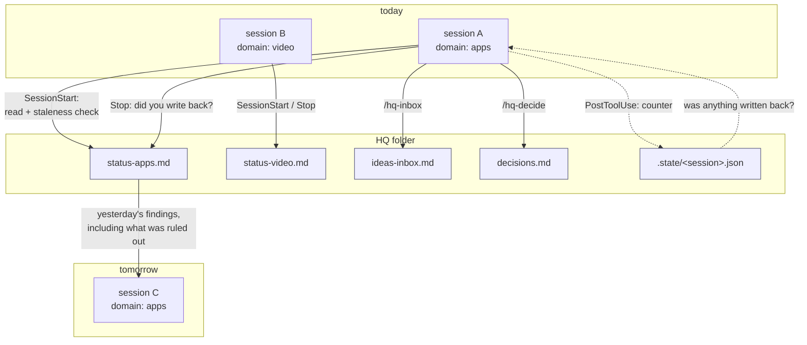

# Design

## The problem

Run more than one Claude Code session and you acquire a coordination problem you did not ask for.

A session is a closed world. It knows its transcript and whatever it can read from disk. It does
not know that the session you ran yesterday already established that the third-party API returns
403 for a whole class of request, or that you decided on Tuesday not to pursue the caching idea,
or that another session is at this moment editing the same file.

The costs are specific and repeat:

- **Rediscovery.** Three sessions independently spend forty minutes each finding the same
  limitation. Two hours, for a line that takes thirty seconds to write.
- **Contradiction.** Session A concludes X. Session B, unaware, concludes not-X. You now have to
  adjudicate, and you were not present for either.
- **Amnesia at the boundary.** The session ends and everything it *learned* — as opposed to
  everything it *changed* — evaporates. Git has the diff. Nothing has the reasoning.
- **Lost negatives.** Dead ends are never written down, because a dead end feels like a day with
  nothing to show. They are then rediscovered indefinitely.

The last one matters most, and it is the one a purely technical solution will not fix. Nobody
writes down failure unless something asks them to.

## One session, or many

Before the coordination problem, there is a choice that causes it.

**One session for everything** is the obvious starting point, and it fails in two distinct ways.
The first is mixing: unrelated work shares a context window, so the model answering a question
about a thumbnail is still carrying the billing bug from this morning. Attention is finite for
models in roughly the way it is for people, and a context full of irrelevance measurably degrades
what comes out of it. The second is loss: a long session compacts, and compaction is lossy by
construction. It drops what it judges least relevant, and it is sometimes wrong.

The second failure has a well-known answer that predates any of this: keep a durable record
outside the window. A notes vault, a git repository of memory files, a wiki. **session-hq does not
replace a second brain, and is not trying to.** The two solve different problems, and the
[layered-memory](../skills/layered-memory/SKILL.md) skill is about doing the second-brain half
well.

**Many sessions, one per project or domain,** fixes the mixing outright. Each session's context
contains only what it is for. This is the right move and most people arrive at it on their own.

It creates the third problem, which is the one this project exists for. At two or three sessions
you can hold the picture in your head. At five or six you cannot, and the failure is quiet: nothing
breaks, no error appears, every individual session is doing good work. You simply lose sight of the
whole — which thread has stalled, which is waiting on a decision only you can make, which one you
have not opened in a week and would not notice was missing. The information exists. It is just
distributed across more windows than a person can hold.

So the design target is not "make sessions talk to each other". It is **make the set of sessions
legible from one place**, cheaply enough that keeping it current is not a second job.

## The org chart

The useful metaphor is a company, and it is worth stating once precisely because it predicts the
design decisions rather than merely decorating them.

Each session is a **department head**. They run their own department, know their area better than
you do, and should not need permission to do their job. You do not want to attend every department
meeting; that is the one-session model, and it is why it fails.

The HQ folder is the **report the department heads file**, and the dashboard is that report read
in one sitting — the view where a CEO sees what has stalled, what is blocked on them, and what
nobody has picked up. This explains several things that would otherwise look arbitrary:

- **Why sessions write their own entries** rather than having them generated. A report a department
  did not write is not a report; it is a guess with a letterhead.
- **Why "Ruled out" is mandatory.** The most valuable line in any status report is the one that
  says *we tried this and it does not work* — and it is the line every department is tempted to
  omit, because a dead end reads as a week with nothing to show.
- **Why the files are per-domain and not per-project.** Departments, not tasks.
- **Why staleness is surfaced rather than hidden.** A report nobody has updated in a month is not
  reassuring; it is the single most important thing on the page.
- **Why nothing here is a workflow engine.** The CEO does not run the departments. They read the
  report and ask questions.

## The approach

A folder of markdown files, one per domain, that every session reads at start and writes at end,
with hooks making both ends happen without anyone remembering to.

Three components:

**Injection (SessionStart and optionally PreCompact under Claude Code; `wrap` elsewhere).** The session's domain file is read into
context before the first user message, trimmed to a line budget, with a staleness banner when it
is older than the configured threshold. The session starts already knowing where things stand.

**Counting (PostToolUse).** A per-session counter in `.state/`. Cheap, and it is what lets the
Stop check distinguish "this session did nothing, so it owes nothing" from "this session did
thirty-four things and wrote none of them down".

**Checking (Stop under Claude Code; process exit under `wrap`).** Hash the status file at session start; compare at stop. Unchanged, after real
work, produces a reminder — or, if configured, a block.

The plugin never writes status content itself. It creates the file, injects it, and asks. What
goes in comes from `/hq-update`, run by a session that actually did the work. An invented status
entry is worse than a missing one, because it will be believed.

## Dispatch, and why it is a file

The third use is running the departments from one seat: the human tells the orchestrator, the
orchestrator tells the department, the department reports back, the orchestrator reviews.

The obvious implementation is messaging — find the live session for that domain and send it the
task. That fails on the common case. Most of the time the target session is not running: it was
closed yesterday when its work was written back, which is exactly the property that makes sessions
disposable. A channel that only works while both ends are alive cannot carry a request across that
gap, and a message that is not delivered leaves nothing behind to notice later.

So a dispatch is a line in `dispatches.md`, and the department is told about it at *its* next
session start, whenever that is. The queue is durable, inspectable, and survives everything —
closing sessions, restarting the machine, losing the tooling entirely.

Live messaging still helps, and the protocol says so: where a harness offers it, a message pointing
at a dispatch id gets attention sooner. It is a notification, never the record. Whether such a
message can be sent or received at all is the harness's business, and this project makes no claims
about it — the guarantee is only that the request and the result are on disk.

The review step (`ack`) exists for the same reason the orchestrator-routing skill insists on it:
delegation without review is not delegation. `done` and `ack` are separate states precisely so that
"a department said it was finished" and "someone checked" cannot be confused.

## Tradeoffs

### Files, not a database

Markdown in a folder, not SQLite, not a service.

*Costs:* no queries, no transactions, no schema enforcement. Two sessions writing the same file at
the same second can produce a mangled result — mitigated by convention (edit your block, never
rewrite the file) rather than by locking, because the failure is rare and the fix for a mangled
markdown file is obvious.

*Benefits, which dominate:* the user can read the state, and so can `grep`, `git diff`, an editor,
a notes app, and a colleague. Sync is whatever you already use. There is nothing to install, no
daemon to be running, no migration when the schema changes, and no corrupt-database failure mode.
Most importantly, the state stays legible when the tooling is absent — you can open the folder in
five years with no plugin installed and it still means something.

A status file that only a program can read is a file the human stops checking, and once nobody
checks it, nothing keeps it honest.

### Hooks, not discipline

The protocol could be a paragraph in `CLAUDE.md`: read the status file, update it when you finish.

That does not survive contact with a busy week. Instructions in a prompt compete with everything
else in the prompt, and the end of a session is precisely when attention is lowest — the work is
done, the user has what they wanted, and the write-up is pure overhead paid by a future stranger.

Hooks are not persuasion. SessionStart puts the file in context whether or not anyone remembered;
Stop notices the omission at the exact moment it happens, when the session still has the context
to fix it in one paragraph. A reminder ten minutes later would need the whole session reconstructed.

Hooks are, however, only the *strongest* adapter, not the only one. The protocol itself is a
folder and a CLI, and `hq.mjs wrap` runs the same two moments around any agent command: print
the status before, check the file after. It cannot see inside the session, so it substitutes
elapsed time for the tool counter and cannot refuse an exit — by the time it regains control
the agent is gone. That is the honest cost of being agent-neutral, and it is set out in
[adapters.md](adapters.md).

The Stop hook can block (`update.enforce: true`) but does not by default. A tool that fights you
gets uninstalled, and an uninstalled tool enforces nothing. Blocking is available for teams where
a missed handoff has a real cost, and the docs are honest that it will feel intrusive.

### Per-domain files, not one file or one per project

One shared file: every session reads everyone else's noise, the file grows without bound, and
concurrent edits collide constantly.

One file per project: too granular. A session rarely maps to exactly one project, the number of
files grows past what anyone maintains, and the cross-project view — which is the actual reason
for having an HQ — disappears.

A domain sits at the natural granularity of a *session*: a lane of work that a whole session tends
to be about. It gives each session exactly the context it needs, keeps unrelated work out of the
context window, keeps concurrent writes on separate files most of the time, and still leaves a
small enough set of files that reading all of them is a reasonable thing to do occasionally.

The failure mode is domains chosen too finely, which is why `/hq-init` pushes toward three to
seven and the docs say to put a doubtful case in the nearest existing domain.

### Staleness by stamp, mtime as fallback

An explicit `<!-- hq:updated ... -->` stamp survives what mtimes do not: checkouts, sync clients,
backup restores, and copying the folder to a new machine. All of those make a stale file look
fresh, which is the one direction of error that matters — a stale file believed current is how you
act on a fact that stopped being true a month ago. mtime remains the fallback so that a file
edited by hand without touching the stamp is still approximately dated.

### Slug, don't trust

Domain names come from config and environment variables and end up in filenames. They are
slugified to `[a-z0-9._-]` with leading dots and dashes stripped, so `HQ_DOMAIN` cannot walk out
of the HQ root into somewhere it should not write.

## Relation to Claude Code's native features

**Cross-session messaging** is live and ephemeral: it answers "what is the session next door doing
right now" and disappears when the sessions do. session-hq is persistent and async: it answers
"what did the last five sessions conclude". Different questions, and both worth being able to ask.
Use messaging to coordinate work in flight; use the HQ to stop repeating work already finished.

**Auto-memory** holds durable facts about a project: how this repo is laid out, what its build
does, what the user prefers here. It is per-project and long-lived. The HQ is cross-project and
current-state: what is in flight, what is blocked, what was ruled out this week. A fact that will
still be true next quarter belongs in memory; a fact that expires in a week belongs in the HQ.

The two skills in this plugin — layered memory and orchestrator routing — are conventions for
using memory and subagents well. They are shipped here because in practice they arrive together:
the moment you run enough sessions to need an HQ, you have enough memory files to need layering
and enough delegated work to need a routing discipline.

## What is deliberately absent

- **No sync.** The HQ is a folder. Use git, a synced drive, or a vault. Building sync in would
  mean building conflict resolution, and markdown already has a conflict resolution tool that
  everyone knows.
- **No automatic summarisation.** A generated status entry is a plausible-sounding entry, which
  is exactly the thing that makes the file untrustworthy. The plugin asks; the session writes.
- **No live server for the dashboard.** `dashboard` writes a static file and, optionally,
  regenerates it on a timer (`--watch`); there is no process listening on a port. The files
  remain the interface — the page is a rendering of them, not a second source of truth.
- **No account or usage-limit features.** One account, many sessions. Anything else is out of
  scope by design, not by omission.
